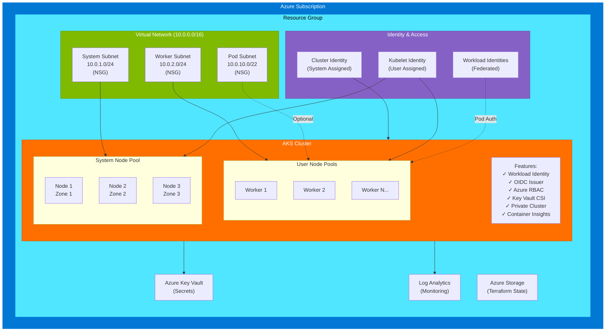

# Azure Kubernetes Service (AKS) Terraform Module

Production-ready Terraform module for deploying and managing Azure Kubernetes Service (AKS) clusters with comprehensive security, networking, and identity management features.

## Features

- **Network Isolation**: VNet with separate subnets for system nodes, worker nodes, and pods
- **Network Security Groups**: Granular security rules for system nodes, worker nodes, and pod subnets
- **Workload Identity**: Azure AD Workload Identity for secure pod-level authentication
- **Private Clusters**: Optional private cluster with private DNS zones
- **Auto-scaling**: Cluster autoscaler with configurable node pools
- **Multiple Node Pools**: System and user node pools with flexible configuration
- **Security Hardening**: RBAC, Azure Policy, Microsoft Defender integration
- **Key Vault Integration**: Azure Key Vault Secrets Provider CSI driver
- **Monitoring**: Azure Monitor integration with Container Insights
- **Flexible Networking**: Support for Azure CNI, kubenet, and custom outbound types
- **IAM Integration**: Managed identities with role-based access control
- **Comprehensive Outputs**: Detailed status reporting and access information

## Architecture



## Prerequisites

- Azure CLI (`az`) - [Install](https://docs.microsoft.com/en-us/cli/azure/install-azure-cli)
- Terraform >= 1.13.0 - [Install](https://www.terraform.io/downloads)
- `jq` for JSON processing
- Azure subscription with appropriate permissions

## Quick Start

### 1. Configure Azure CLI

```bash
# Login to Azure
az login

# Set your subscription
az account set --subscription <subscription-id>
```

### 2. Create Configuration

Copy and customize the demo configuration:

```bash
cp configs/demo.yaml configs/my-cluster.yaml
# Edit configs/my-cluster.yaml with your settings
```

### 3. Setup Backend Storage

The Terraform state is stored in Azure Storage. Run the setup script to create the storage account:

```bash
./tools/setup -c configs/my-cluster.yaml
```

This will:
- Create a resource group (if needed)
- Create an Azure Storage account
- Create a blob container for state
- Enable versioning and soft delete
- Generate backend configuration

### 4. Initialize Backend

Uncomment the backend configuration in `terraform/backend.tf` or use the generated `backend.tfvars`:

```bash
cd terraform
terraform init -backend-config=backend.tfvars
```

### 5. Deploy Cluster

```bash
# Validate configuration
./tools/actuate -c configs/my-cluster.yaml validate

# Plan deployment
./tools/actuate -c configs/my-cluster.yaml plan

# Apply deployment
./tools/actuate -c configs/my-cluster.yaml apply
```

### 6. Access Cluster

```bash
# Get kubeconfig
az aks get-credentials \
  --resource-group <resource-group> \
  --name <cluster-name>

# Verify access
kubectl get nodes
kubectl get pods -A
```

## Configuration

The cluster is configured via YAML file. See `configs/demo.yaml` for a complete example.

### Key Configuration Sections

#### Deployment

```yaml
deployment:
  id: "my-aks"
  csp: Azure
  tenancy: "00000000-0000-0000-0000-000000000000"  # Azure subscription ID
  location: "eastus"
  destroy: false
  tags:
    environment: "production"
    team: "platform"
  azure:
    resourceGroup: "my-aks-rg"  # Resource group name
```

#### Cluster

```yaml
cluster:
  name: "my-aks-cluster"
  version: "1.30"
  skuTier: "Standard"  # Free or Standard
  automaticUpgrade: "stable"
  features:
    workloadIdentity: true
    oidcIssuer: true
    azureKeyVaultSecretsProvider: true
    azurePolicy: false
  private:
    enabled: true
    privateDnsZoneId: null
```

#### Network

```yaml
network:
  vnetAddressSpace: "10.0.0.0/16"
  systemSubnetCidr: "10.0.1.0/24"
  workerSubnetCidr: "10.0.2.0/24"
  podSubnetCidr: "10.0.10.0/22"      # Optional for Azure CNI
  podCidr: "10.244.0.0/16"
  serviceCidr: "10.245.0.0/16"
  dnsServiceIp: "10.245.0.10"
  networkPlugin: "azure"              # azure or kubenet
  outboundType: "loadBalancer"        # loadBalancer, natGateway, or userDefinedRouting
```

#### Node Pools

```yaml
compute:
  nodePools:
    system:
      mode: "System"
      vmSize: "Standard_D4s_v5"
      autoscaling:
        enabled: true
        minSize: 2
        maxSize: 5
      availabilityZones: ["1", "2", "3"]
      maxPods: 110
      osDiskSizeGb: 128
    
    worker:
      mode: "User"
      vmSize: "Standard_D8s_v5"
      autoscaling:
        enabled: true
        minSize: 3
        maxSize: 10
```

#### Security

```yaml
security:
  localAccounts: false
  rbac: true
  networkPolicy: "azure"
  defenderEnabled: true
  adminGroupObjectIds:
    - "00000000-0000-0000-0000-000000000000"
```

#### IAM (Workload Identity)

```yaml
iam:
  workloadIdentities:
    app1:
      namespace: "default"
      serviceAccount: "app1-sa"
      roleAssignments:
        scope: "/subscriptions/<sub-id>/resourceGroups/<rg>"
        role: "Storage Blob Data Contributor"
```

## Advanced Features

### Workload Identity

Azure AD Workload Identity allows pods to authenticate using federated credentials:

1. Define workload identities in configuration
2. Deploy pods with service account
3. Pods automatically get Azure AD tokens

Example pod configuration:

```yaml
apiVersion: v1
kind: ServiceAccount
metadata:
  name: app1-sa
  namespace: default
  annotations:
    azure.workload.identity/client-id: <client-id>
---
apiVersion: v1
kind: Pod
metadata:
  name: app1
  namespace: default
  labels:
    azure.workload.identity/use: "true"
spec:
  serviceAccountName: app1-sa
  containers:
  - name: app
    image: myapp:latest
```

### Private Clusters

For enhanced security, enable private cluster mode:

```yaml
cluster:
  private:
    enabled: true
    privateDnsZoneId: null  # Auto-managed or custom
```

Access requires:
- VPN or ExpressRoute to Azure VNet
- Jump host in the VNet
- Private endpoint configuration

### Custom Outbound Connectivity

Choose outbound type based on requirements:

- **loadBalancer**: Default, uses Azure Load Balancer
- **natGateway**: Dedicated NAT Gateway for static IPs
- **userDefinedRouting**: Route through Azure Firewall or NVA

### Auto-scaler Tuning

Customize cluster autoscaler behavior:

```yaml
cluster:
  autoScalerProfile:
    scaleDownUtilizationThreshold: "0.5"
    scaleDownUnneeded: "10m"
    maxGracefulTerminationSec: 600
```

## Outputs

After deployment, comprehensive status information is available:

```bash
# View outputs
./tools/actuate -c configs/my-cluster.yaml output

# Or use Terraform directly
cd terraform
terraform output status
```

A JSON status file is also written to the config directory:

```bash
cat configs/my-cluster-status.json | jq .
```

## Maintenance

### Upgrade Cluster

```bash
# Update version in config
# cluster.version: "1.31"

# Plan and apply
./tools/actuate -c configs/my-cluster.yaml plan
./tools/actuate -c configs/my-cluster.yaml apply
```

### Scale Node Pools

Adjust node pool sizes in configuration and apply:

```yaml
compute:
  nodePools:
    worker:
      autoscaling:
        minSize: 5
        maxSize: 20
```

### Add Node Pool

Add new node pool to configuration:

```yaml
compute:
  nodePools:
    gpu:
      mode: "User"
      vmSize: "Standard_NC6s_v3"
      autoscaling:
        enabled: true
        minSize: 0
        maxSize: 3
```

## Troubleshooting

### Check AKS Status

```bash
az aks show \
  --resource-group <resource-group> \
  --name <cluster-name> \
  --query "provisioningState"
```

### View Logs

```bash
# Cluster autoscaler logs
kubectl logs -n kube-system -l app=cluster-autoscaler

# CSI driver logs
kubectl logs -n kube-system -l app=secrets-store-csi-driver
```

### Common Issues

1. **Network connectivity**: Verify NSG rules and subnet associations
2. **Identity issues**: Check managed identity role assignments
3. **Node pool issues**: Review node pool configuration and quotas

### Validation

```bash
# Validate Terraform configuration
cd terraform
terraform validate

# Check Azure resources
az aks check-acr --name <cluster-name> --resource-group <rg> --acr <acr-name>
```

## Cleanup

To destroy all resources:

```bash
./tools/actuate -c configs/my-cluster.yaml destroy
```

Or manually:

```bash
cd terraform
terraform destroy -var="CONFIG_PATH=../configs/my-cluster.yaml"
```

## Security Best Practices

1. **Enable private cluster** for production workloads
2. **Disable local accounts** and use Azure AD authentication
3. **Enable Azure Policy** for compliance enforcement
4. **Use workload identity** instead of managed identity per pod
5. **Enable Microsoft Defender** for threat detection
6. **Configure network policies** to restrict pod communication
7. **Use separate node pools** for workload isolation
8. **Enable pod security standards** with admission controllers
9. **Regularly update** cluster and node versions
10. **Monitor** with Azure Monitor and Container Insights

## Network Security

The module creates NSGs with the following rules:

**System Node Pool NSG:**
- SSH access from authorized IPs
- Node-to-node communication
- Kubelet health checks
- ICMP for path MTU discovery
- Deny all other inbound traffic

**Worker Node Pool NSG:**
- SSH access from authorized IPs
- Node-to-node communication
- Kubelet health checks
- Load balancer ingress
- ICMP for path MTU discovery
- Deny all other inbound traffic

**Pod NSG (optional):**
- Pod-to-pod communication
- Access from nodes
- ICMP for path MTU discovery

## Examples

See the `configs/` directory for example configurations:

- `demo.yaml` - Complete production-ready configuration with all features
- Add your own configurations as needed

## Support

For issues and questions:
- Azure AKS Documentation: https://docs.microsoft.com/en-us/azure/aks/
- Terraform Azure Provider: https://registry.terraform.io/providers/hashicorp/azurerm/latest/docs

## License

See LICENSE file in repository root.
