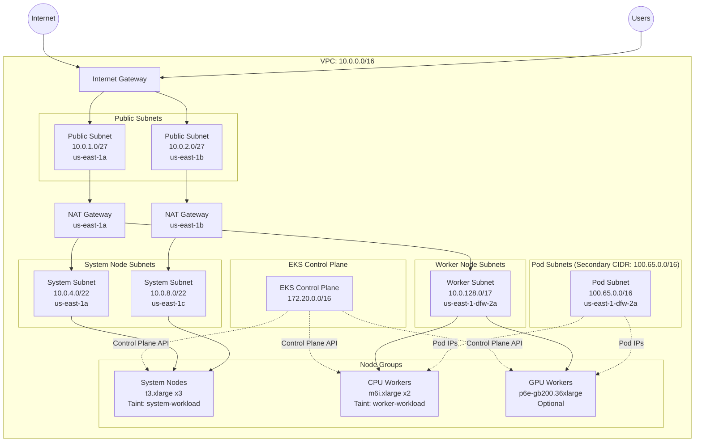
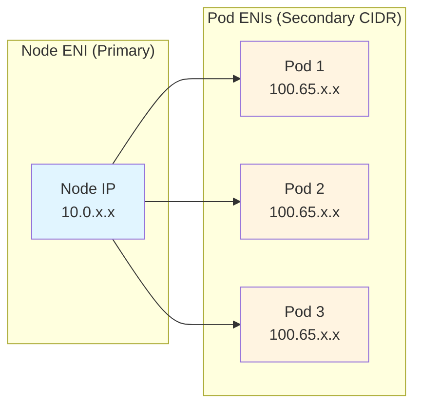
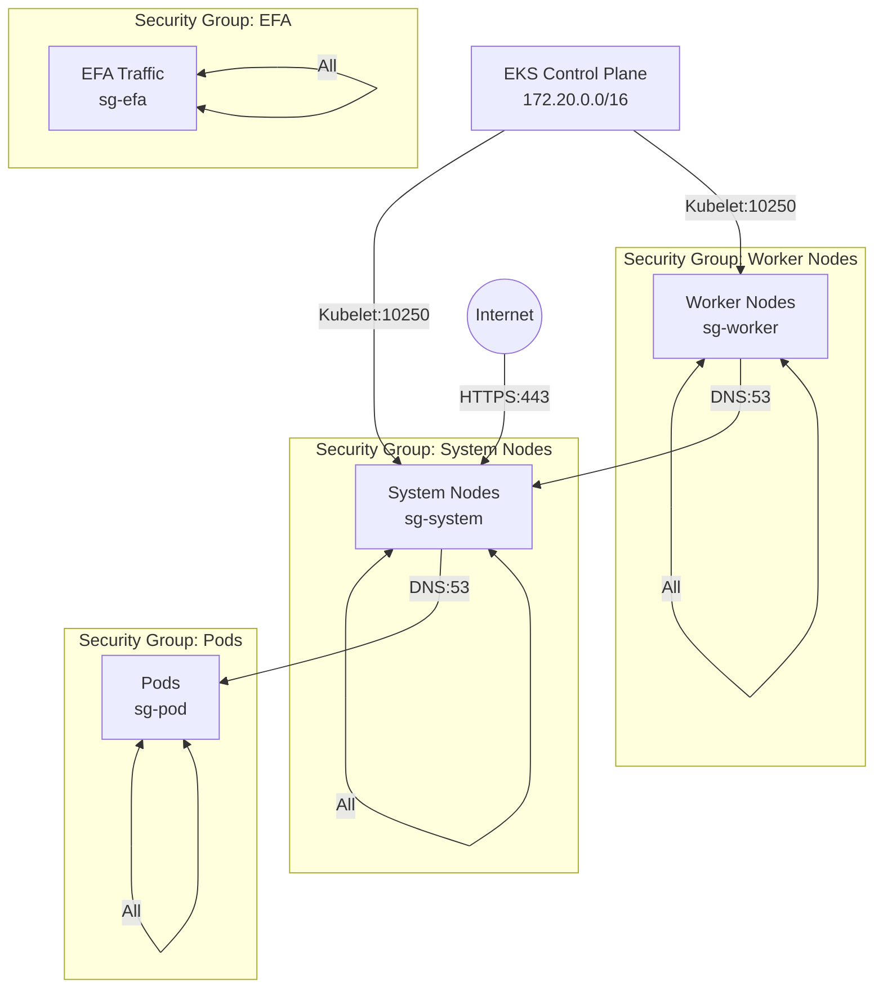

# Amazon EKS Cluster Builder

> **Easy deployment with advanced networking, security, and observability features.**

## 📋 Table of Contents

- [Overview](#overview)
- [Deployment](#deployment)
- [Architecture](#architecture)
- [Key Features](#key-features)
- [Network Architecture](#network-architecture)
- [Configuration Guide](#configuration-guide)
  - [Configuration File Structure](#configuration-file-structure)
  - [Node Group Types](#node-group-types)
  - [Capacity Reservations](#capacity-reservations)
  - [Operational Parameters (Optional)](#operational-parameters-optional)
- [Security](#security)
- [Monitoring & Observability](#monitoring--observability)
- [Outputs](#outputs)
- [Troubleshooting](#troubleshooting)

---

## 🎯 Overview

This Terraform module deploys a fully-featured Amazon EKS cluster with:

- **Multi-AZ deployment** for high availability
- **Custom VPC networking** with VPC CNI custom networking (secondary CIDR for pods)
- **Self-managed node groups** with system and worker node separation
- **Advanced security** with KMS encryption, VPC Flow Logs, and security group isolation
- **Full observability** with CloudWatch integration and metrics
- **Production-ready configurations** including health checks, auto-scaling, and instance refresh

### Architecture Diagram



---

## ⭐ Key Features

### 🔐 Security

| Feature | Description | Status |
|---------|-------------|--------|
| **KMS Encryption** | Customer-managed keys for EKS secrets and logs | ✅ Enabled |
| **VPC Flow Logs** | Network traffic monitoring to CloudWatch | ✅ Enabled |
| **Security Group Isolation** | Separate SGs for system, worker, pod, and EFA traffic | ✅ Enabled |
| **Private Node Communication** | Nodes communicate via private IPs through NAT | ✅ Enabled |
| **IAM Roles for Service Accounts (IRSA)** | Pod-level IAM permissions via OIDC | ✅ Enabled |
| **Encrypted EBS Volumes** | All node volumes encrypted at rest | ✅ Enabled |
| **IMDSv2 Required** | Enhanced metadata service security | ✅ Enabled |

### 📊 Observability

| Component | Purpose | Retention |
|-----------|---------|-----------|
| **EKS Control Plane Logs** | API server, audit, authenticator logs | 7 days by default |
| **VPC Flow Logs** | Network traffic analysis | 7 days by default |
| **CloudWatch Observability** | Cluster metrics and pod logs | Configured |
| **Metrics Server** | Resource usage metrics (CPU/memory) | Real-time |
| **ASG CloudWatch Metrics** | 8 metrics per autoscaling group | 1-minute |

### 🚀 Operational Excellence

- **Health Checks**: EC2 health checks with 5-minute grace period
- **Instance Refresh**: Rolling updates with 90% minimum healthy
- **Auto Scaling**: Cluster Autoscaler tags configured
- **Lifecycle Management**: `ignore_changes` for cluster autoscaler compatibility
- **Termination Policies**: OldestLaunchTemplate → OldestInstance

### 🎛️ EKS Add-ons

| Add-on | Version | Purpose | IAM Role |
|--------|---------|---------|----------|
| **CoreDNS** | Auto/Configurable | DNS resolution with custom forwarding | - |
| **VPC CNI** | Auto/Configurable | Pod networking with custom CIDR | - |
| **kube-proxy** | Auto/Configurable | Network proxy | - |
| **aws-ebs-csi-driver** | Auto/Configurable | Persistent volume support | ✅ IRSA |
| **metrics-server** | Auto/Configurable | Resource metrics | - |
| **CloudWatch Observability** | Auto/Configurable | Logs and metrics collection | ✅ IRSA |

---

## 🏗️ Network Architecture

### VPC CIDR Design

```
Primary VPC CIDR: 10.0.0.0/16 (65,536 IPs)
├── Public Subnets:    10.0.1.0/27  - 10.0.2.0/27   (64 IPs each)
├── System Subnets:    10.0.4.0/22  - 10.0.8.0/22   (1,024 IPs each)
└── Worker Subnets:    10.0.128.0/17                (32,768 IPs)

Secondary CIDR: 100.65.0.0/16 (65,536 IPs)
└── Pod Subnets:       100.65.0.0/16                (All for pods)
```

### VPC CNI Custom Networking

**Why Custom Networking?**
- Separates node IPs from pod IPs
- Prevents IP exhaustion on primary CIDR
- Enables larger pod densities per node
- Better security isolation



### ENIConfig Custom Resource

Each availability zone has an ENIConfig specifying:
- **Subnet**: Pod subnet in that AZ
- **Security Groups**: Pod security group
- **Zone Label**: `topology.kubernetes.io/zone`

Example:
```yaml
apiVersion: crd.k8s.amazonaws.com/v1alpha1
kind: ENIConfig
metadata:
  name: us-east-1-dfw-2a
spec:
  subnet: subnet-059ba27f2af6fefb6
  securityGroups:
    - sg-02b0d0a11d801abef
```

### VPC Endpoints

Private endpoints for AWS services (no internet egress required):

- **S3** - Gateway endpoint
- **SSM, EC2Messages, SSMMessages** - Session Manager
- **CloudWatch Logs** - Log shipping

---

## 📖 Configuration Guide

### Configuration File Structure

```yaml
apiVersion: github.com/mchmarny/cluster/v1alpha1
kind: Cluster

deployment:
  id: d1  # used to prefix all resources (must be unique per tenancy)
  csp: AWS
  tenancy: "123456789101"  # AWS account ID
  location: us-east-1
  destroy: false
  tags:
    owner: mchmarny
    env: dev

cluster:
  name: demo-cluster
  version: "1.33"  # optional, defaults to latest
  addOns:  # optional, empty version "" defaults to latest, or null to disable
    coreDns: ""
    vpcCni: ""
    kubeProxy: ""
    cloudwatchObservability: ""
    metricsServer: ""
    ebsCsi: ""
  controlPlane:
    cidr: 172.20.0.0/16
    allowedCidrs: # CIDRs allowed to access control plane (e.g. kubectl)
      - 20.30.40.50/27
      - 2.3.4.5/32
  adminRoles:
    - ClusterAdmins

observability:
  logRetentionInDays: 7
  metricsGranularity: "1Minute"

network:
  cidrs:
    host: 10.0.0.0/16
    pod: 100.65.0.0/16
  subnets:
    public:
      - cidr: 10.0.1.0/27
        zone: us-east-1a
      - cidr: 10.0.2.0/27
        zone: us-east-1b
    system:
      - cidr: 10.0.4.0/22
        zone: us-east-1a
      - cidr: 10.0.8.0/22
        zone: us-east-1c
    worker:
      - cidr: 10.0.128.0/17
        zone: us-east-1-dfw-2a
        disableEndpoints: true
    pod:
      - cidr: 100.65.0.0/16
        zone: us-east-1-dfw-2a
        disableEndpoints: true
  endpoints:
    - s3
    - ssm
    - ec2messages
    - ssmmessages
    - logs

compute:
  sshPublicKey: "ssh-ed25519 AAA..."

  nodeGroups:

    system:
      instanceType: t3.xlarge
      imageId: ami-0ad0f739ba9218571
      capacity:
        desired: 3
        min: 3
        max: 6
      blockDevice:
        mount: "/dev/sda1"
        type: gp3
        size: 500
      labels:
        nodeGroup: system

    workers:
      - name: amd-cpu-worker-1
        instanceType: m6i.xlarge
        imageId: ami-0ad0f739ba9218571
        capacity:
          desired: 1  # min/max are inferred from desired
        blockDevice:
          mount: "/dev/sda1"
          type: gp3
          size: 50
        labels:
          nodeGroup: cpu-worker

      - name: arm-cpu-worker-1  # example of multiple node groups of the same type, block device omitted to use defaults
        instanceType: c6gn.xlarge
        imageId: ami-09bf1e83f45a97282
        capacity:
          desired: 1
        labels:
          nodeGroup: cpu-worker

      - name: gpu-worker-1
        instanceType: p6e-gb200.36xlarge
        gpuType: gb200
        imageId: ami-09bf1e83f45a97282
        capacity:
          desired: 0
          reservation:  # example of capacity reservation usage
            marketType: capacity-block
            preference: capacity-reservations-only
            resourceGroup: demo-gb200-rg  # arn derived form account id and region
        labels:
          nodeGroup: gpu-worker
```

### Node Group Types

#### System Nodes
- **Purpose**: Run cluster-critical workloads (CoreDNS, metrics-server, etc.)
- **Taint**: `dedicated=system-workload:NoSchedule,NoExecute`
- **Instance Type**: General-purpose (e.g. t3.xlarge)
- **Tolerations**: Required for system pods

#### Worker Nodes
- **Purpose**: Run application workloads
- **Taint**: `dedicated=worker-workload:NoSchedule,NoExecute`
- **Instance Types**: 
  - CPU: `m6i.xlarge` (general compute)
  - GPU: `p6e-gb200.36xlarge` (AI/ML with GB200 GPUs)
  - EFA: Automatically configured for GPU instances

### Capacity Reservations

For GPU instances, use capacity reservations:

```yaml
capacity:
  desired: 0
  reservation:
    marketType: capacity-block           # or spot
    preference: capacity-reservations-only
    resourceGroup: demo-gb200-rg         # Resource group name
```

ARN is constructed as: `arn:aws:resource-groups:{region}:{account}:group/{resourceGroup}`

### Operational Parameters (Optional)

All operational parameters have sensible defaults but can be customized per environment:

```yaml
# Security Configuration
security:
  kms:
    deletionWindowInDays: 30      # KMS key deletion window (7-30 days)

# Observability Configuration  
observability:
  logRetentionInDays: 7           # EKS cluster logs retention
  vpcFlowLogs:
    retentionInDays: 7            # VPC Flow Logs retention
  metrics:
    granularity: "1Minute"        # CloudWatch metrics: "1Minute" or "5Minute"

# Networking Configuration
networking:
  coreDns:
    cacheSeconds: 30              # DNS cache TTL in seconds
  vpcCni:
    minimumIpTarget: 30           # Minimum IPs to maintain per node
    warmIpTarget: 20              # Pre-allocated warm IPs per node

# Compute Configuration
compute:
  defaults:
    blockVolumeSize: 50           # Default EBS volume size (GB)
    blockVolumeType: "gp3"        # Default EBS volume type
    
  autoscaling:
    healthCheck:
      type: "EC2"                 # Health check type: "EC2" or "ELB"
      gracePeriod: 300            # Seconds before health checks start
    capacityTimeout: "10m"        # Max wait time for capacity
    terminationPolicies:          # Order of instance termination
      - "OldestLaunchTemplate"
      - "OldestInstance"
    instanceRefresh:
      minHealthyPercentage: 90    # Min % healthy during rolling updates
      instanceWarmup: 300         # Seconds for new instances to warm up
      checkpointPercentages: [50, 100]  # Validation checkpoints

# Add-ons Configuration
cluster:
  addOns:
    # Specify version string, empty string "" for latest, or null to disable
    coreDns: ""                              # "" = use latest
    vpcCni: "v1.20.2-eksbuild.1"            # Specific version
    kubeProxy: ""                            # "" = use latest
    cloudwatchObservability: ""              # "" = use latest
    metricsServer: ""                        # "" = use latest
    ebsCsi: null                             # null = disabled
```

#### Parameter Defaults

If not specified in the configuration, the following defaults are used:

| Category | Parameter | Default | Valid Range/Options |
|----------|-----------|---------|---------------------|
| **Security** | KMS deletion window | 30 days | 7-30 days |
| **Observability** | EKS log retention | 7 days | 1, 3, 5, 7, 14, 30, 60, 90 |
| | VPC Flow Log retention | 7 days | Same as above |
| | Metrics granularity | 1Minute | 1Minute, 5Minute |
| **Networking** | CoreDNS cache TTL | 30 seconds | 0-300 seconds |
| | VPC CNI minimum IPs | 30 | 1-100 |
| | VPC CNI warm IPs | 20 | 1-100 |
| **Compute** | Block volume size | 50 GB | 8-16384 GB |
| | Block volume type | gp3 | gp2, gp3, io1, io2 |
| **ASG** | Health check type | EC2 | EC2, ELB |
| | Health check grace | 300 sec | 0-7200 seconds |
| | Capacity timeout | 10m | Valid duration string |
| | Min healthy % | 90% | 0-100 |
| | Instance warmup | 300 sec | 0-3600 seconds |

#### Parameter Impact

**Security:**
- `deletionWindowInDays`: Longer windows provide more time to recover accidentally deleted keys but delay full deletion

**Observability:**
- `logRetentionInDays`: Balance between compliance requirements and storage costs
- `metricsGranularity`: 1-minute granularity provides better insights but increases costs

**Networking:**
- `minimumIpTarget`/`warmIpTarget`: Higher values reduce IP allocation delays but consume more IPs
- `cacheSeconds`: Higher values reduce DNS queries but delay DNS updates

**Autoscaling:**
- `minHealthyPercentage`: Lower values speed up rollouts but increase risk
- `instanceWarmup`: Should match application startup time
- `checkpointPercentages`: More checkpoints = safer but slower deployments
- `healthCheckGracePeriod`: Should exceed typical node bootstrap time (~3-5 minutes)

### Configuration Examples

#### Minimal Development Cluster

```yaml
apiVersion: github.com/mchmarny/cluster/v1alpha1
kind: Cluster

deployment:
  id: dev1
  csp: AWS
  tenancy: "123456789012"  # AWS account ID
  location: us-east-1
  destroy: false
  tags:
    owner: developer
    env: dev

cluster:
  name: dev-cluster
  version: "1.33"
  addOns:
    coreDns: ""
    vpcCni: ""
    kubeProxy: ""
  controlPlane:
    cidr: 172.20.0.0/16
    allowedCidrs:
      - 0.0.0.0/0  # Restrict to your IP in production!

compute:
  sshPublicKey: "ssh-ed25519 AAAA..."
  nodeGroups:
    system:
      instanceType: t3.medium
      imageId: ami-0ad0f739ba9218571
      capacity:
        desired: 2
        min: 2
        max: 3
    workers:
      - name: cpu-worker
        instanceType: m5.large
        imageId: ami-0ad0f739ba9218571
        capacity:
          desired: 1
```

**Use case:** Quick development/testing with minimal resources.

#### Production Cluster with GPU Workers

```yaml
apiVersion: github.com/mchmarny/cluster/v1alpha1
kind: Cluster

deployment:
  id: prod1
  csp: AWS
  tenancy: "123456789101"  # AWS account ID
  location: us-east-1
  destroy: false
  tags:
    env: prod

cluster:
  name: prod-cluster
  version: "1.34"
  addOns:
    coreDns: ""
    vpcCni: ""
    kubeProxy: ""
    cloudwatchObservability: ""
    metricsServer: ""
    ebsCsi: ""
  controlPlane:
    cidr: 172.20.0.0/16
    allowedCidrs: # CIDRs allowed to access control plane (e.g. kubectl)
      - 1.2.3.4/27
      - 5.6.7.8/32
  adminRoles:
    - AWSOS-AD-Admin

observability:
  logRetentionInDays: 7
  metricsGranularity: "1Minute"

network:
  cidrs:
    host: 10.0.0.0/16
    pod: 100.65.0.0/16
  subnets:
    public:
      - cidr: 10.0.1.0/27
        zone: us-east-1a
      - cidr: 10.0.2.0/27
        zone: us-east-1b
    system:
      - cidr: 10.0.4.0/22
        zone: us-east-1a
      - cidr: 10.0.8.0/22
        zone: us-east-1c
    worker:
      - cidr: 10.0.128.0/17
        zone: us-east-1-dfw-2a
        disableEndpoints: true
    pod:
      - cidr: 100.65.0.0/16
        zone: us-east-1-dfw-2a
        disableEndpoints: true
  endpoints:
    - s3
    - ssm
    - ec2messages
    - ssmmessages
    - logs

compute:
  sshPublicKey: "ssh-ed25519 AAA..."

  nodeGroups:

    system:
      instanceType: t3.xlarge
      imageId: ami-0ad0f739ba9218571
      capacity:
        desired: 3
        min: 3
        max: 6
      blockDevice:
        mount: "/dev/sda1"
        type: gp3
        size: 500
      labels:
        nodeGroup: system

    workers:
      - name: amd-cpu-worker-1
        instanceType: m6i.xlarge
        imageId: ami-0ad0f739ba9218571
        capacity:
          desired: 2
        blockDevice:
          mount: "/dev/sda1"
          type: gp3
          size: 50
        labels:
          nodeGroup: arm-cpu-worker

      - name: arm-cpu-worker-1 
        instanceType: c6gn.xlarge
        imageId: ami-09bf1e83f45a97282
        capacity:
          desired: 2
        labels:
          nodeGroup: amd-cpu-worker

      - name: gpu-worker-1
        instanceType: p6e-gb200.36xlarge
        gpuType: gb200
        imageId: ami-09bf1e83f45a97282
        capacity:
          desired: 2
          reservation:
            marketType: capacity-block
            preference: capacity-reservations-only
            resourceGroup: demo-gb200-rg  # arn derived form account id and region
        labels:
          nodeGroup: gpu-worker

```

**Use case:** Production ML training cluster with autoscaling and observability.

#### Multi-AZ High Availability Cluster

```yaml
network:
  cidrs:
    host: 10.0.0.0/16
    pod: 100.65.0.0/16
  subnets:
    public:
      - {cidr: 10.0.1.0/27, zone: us-east-1a}
      - {cidr: 10.0.2.0/27, zone: us-east-1b}
      - {cidr: 10.0.3.0/27, zone: us-east-1c}
    system:
      - {cidr: 10.0.4.0/22, zone: us-east-1a}
      - {cidr: 10.0.8.0/22, zone: us-east-1b}
      - {cidr: 10.0.12.0/22, zone: us-east-1c}
    worker:
      - {cidr: 10.0.64.0/18, zone: us-east-1a}
      - {cidr: 10.0.128.0/18, zone: us-east-1b}
      - {cidr: 10.0.192.0/18, zone: us-east-1c}
    pod:
      - {cidr: 100.65.0.0/18, zone: us-east-1a}
      - {cidr: 100.65.64.0/18, zone: us-east-1b}
      - {cidr: 100.65.128.0/18, zone: us-east-1c}

compute:
  nodeGroups:
    system:
      capacity:
        desired: 6  # 2 per AZ
        min: 6
        max: 12
```

**Use case:** High-availability production cluster across 3 AZs.

### Best Practices

#### Configuration Management

1. **Version Control**: Store configs in Git
2. **Secrets**: Never commit sensitive data (SSH keys, credentials)
3. **Environment Separation**: Use separate configs for dev/staging/prod
4. **Naming Convention**: Use consistent deployment IDs (e.g., `{env}-{region}-{number}`)

#### Security

1. **Restrict Control Plane Access**: Use specific CIDR blocks, not `0.0.0.0/0`
2. **Enable All Logs**: Always enable control plane logging for audit
3. **Rotate Keys**: Regularly update SSH keys and KMS keys
4. **Least Privilege**: Grant minimum IAM permissions needed

#### Cost Optimization

1. **Right-Size Instances**: Start small, scale based on actual usage
2. **Use Spot Instances**: For non-critical worker nodes
3. **Enable Autoscaling**: Scale down during off-hours
4. **Monitor Costs**: Set up CloudWatch billing alarms

#### Operational Excellence

1. **Tag Everything**: Consistent tagging for cost allocation and organization
2. **Document Changes**: Update configs with comments explaining why
3. **Test Changes**: Validate in dev before applying to production
4. **Backup State**: Enable S3 versioning for state files
5. **Plan Before Apply**: Always review Terraform plans

---

## 🚀 Deployment

### Prerequisites

**Required Tools:**
- **AWS CLI** >= 2.0 configured with appropriate credentials
- **Terraform** >= 1.13.0
- **yq** >= 4.0 for YAML parsing
- **kubectl** >= 1.28 for cluster access (post-deployment)

**AWS Requirements:**
- IAM permissions to create EKS, VPC, EC2, KMS, IAM resources
- Account limits sufficient for the desired instance types
- SSH key pair for node access (can be generated)

### Step 1: Setup Account

The setup script prepares your AWS account with required S3 state bucket and IAM permissions:

```shell
tools/setup configs/demo.yaml
```

**What this does:**
- Creates S3 bucket `cluster-builder-state-{account-id}` with versioning enabled
- Configures bucket encryption and lifecycle policies
- Creates IAM policy with required permissions
- Validates AWS account matches configuration

**Output:**
```
[MSG] Account ID: <ACCOUNT_ID>
[MSG] User:       cluster-builder-sa
[MSG] Policy:     cluster-builder-policy
[MSG] Bucket:     cluster-builder-state-<ACCOUNT_ID>
[MSG] Output:     /path/to/terraform
```

### Step 2: Create Cluster

Deploy the EKS cluster using your configuration:

```shell
tools/actuate configs/demo.yaml
```

**What this does:**
1. **Initialize Terraform**: Configures S3 backend for state management
2. **Plan**: Creates execution plan showing all resources to be created
3. **Apply**: Provisions all infrastructure (VPC, EKS, node groups, add-ons)

**Output:**
```
[MSG] Using
[MSG]  config:     /dev/aws/eks/tf/configs/demo.yaml
[MSG]  source:     /dev/aws/eks/tf/terraform
[MSG]  deployment: d1
[MSG]  location:   us-east-1
[MSG]  tenancy:    <ACCOUNT_ID>
[MSG]  bucket:     cluster-builder-state-<ACCOUNT_ID>
[MSG]  destroy:    no
[MSG]  state:      s3://cluster-builder-state-<ACCOUNT_ID>/deployments/us-east-1/d1/terraform.tfstate
```

**Deployment time:** Approximately 15-20 minutes for full cluster creation.

### Step 3: Configure kubectl

After deployment completes, configure kubectl to access your cluster:

> The `aws eks update-kubeconfig...` command is included in the status output 

Verify cluster access:

```shell
kubectl get nodes
kubectl get pods -A
```

### Updating a Cluster

To update an existing cluster with configuration changes:

```shell
tools/actuate configs/simple.yaml
```

Terraform will:
- Compare current state with desired state
- Show changes to be made
- Apply only the necessary updates

### Destroying a Cluster

To tear down all infrastructure, set destroy flag in config:

```yaml
deployment:
  destroy: true
```

Then run:

```shell
tools/actuate configs/simple.yaml
```

**Warning:** This will delete:
- All node groups and EC2 instances
- EKS cluster
- VPC and all networking resources
- KMS keys (with deletion window)
- CloudWatch logs (depending on retention settings)

### Deployment Tools

#### `tools/setup`

Prepares AWS account for cluster deployment.

**Usage:**
```shell
tools/setup configs/simple.yaml
```

**Operations performed:**
1. Validates AWS credentials and account ID
2. Creates or validates S3 state bucket with:
   - Versioning enabled
   - Server-side encryption (AES256)
   - Lifecycle rules for old versions
   - Public access blocking
3. Creates IAM policy with minimum required permissions
4. Outputs backend configuration

**Environment variables:**
- `SA_NAME`: Service account name (default: `cluster-builder-sa`)
- `POLICY_NAME`: IAM policy name (default: `cluster-builder-policy`)

#### `tools/actuate`

Main deployment tool for creating/updating/destroying clusters.

**Usage:**
```shell
tools/actuate configs/simple.yaml
```

**Features:**
- Automatic Terraform initialization with S3 backend
- State migration support
- Plan generation with output caching
- Automatic apply with change validation
- Destroy mode via configuration flag

**Environment variables:**
- `SRC_DIR`: Terraform source directory (default: `./terraform`)

**State Management:**
- State stored in: `s3://{bucket}/deployments/{region}/{deployment-id}/terraform.tfstate`
- State locking: DynamoDB table (if configured)
- State backup: S3 versioning

**Error Handling:**
- Validates configuration file exists
- Checks required tools (terraform, yq)
- Verifies S3 bucket accessibility
- Exits on any error (via `set -euo pipefail`)

#### `tools/common`

Shared utility functions used by other tools.

**Functions:**
- `msg()`: Print info messages with color
- `err()`: Print error messages and exit
- `has_tools()`: Validate required CLI tools are installed

### State Management

Terraform state is stored in S3 with the following structure:

```
s3://cluster-builder-state-{account-id}/
└── deployments/
    └── {region}/
        └── {deployment-id}/
            └── terraform.tfstate
```

**Benefits:**
- Multiple deployments in same account
- Regional isolation
- State versioning for rollback
- Team collaboration support
- Encryption at rest

---

## 🔒 Security

### Encryption

| Component | Encryption Method | Key |
|-----------|------------------|-----|
| **EKS Secrets** | KMS encryption | Customer-managed |
| **EBS Volumes** | EBS encryption | AWS-managed |
| **CloudWatch Logs** | KMS encryption | Customer-managed |
| **VPC Flow Logs** | KMS encryption | Customer-managed |

### KMS Key Policy

The KMS key includes policies for:
- Root account management
- CloudWatch Logs service access
- EKS service access

### Security Groups



#### Security Group Rules Summary

**System Node SG:**
- Inbound: Self (all), HTTPS from workers/pods/control plane, kubelet from control plane
- Outbound: All

**Worker Node SG:**
- Inbound: Self (all), kubelet from control plane, ephemeral ports from system
- Outbound: All

**Pod SG:**
- Inbound: Self (all), traffic from nodes
- Outbound: All

**EFA SG:**
- Inbound: Self (all) for high-bandwidth GPU communication
- Outbound: Self (all)

### IAM Roles

| Role | Purpose | Policies |
|------|---------|----------|
| `eks-cluster` | EKS control plane | EKSClusterPolicy, EKSVPCResourceController |
| `system-nodes` | System EC2 instances | EKSWorkerNodePolicy, CNI, ECR, SSM, FSx, EBS CSI, custom monitoring |
| `worker-nodes` | Worker EC2 instances | EKSWorkerNodePolicy, CNI, ECR, SSM, EBS CSI |
| `cloudwatch-observability` | IRSA for CloudWatch | CloudWatchAgentServerPolicy, XRayDaemonWriteAccess |
| `ebs-csi-driver` | IRSA for EBS CSI | AmazonEBSCSIDriverPolicy |
| `vpc-flow-logs` | VPC Flow Logs | Custom CloudWatch Logs policy |

---

## 📊 Monitoring & Observability

### CloudWatch Log Groups

```bash
# EKS Control Plane Logs
/aws/eks/demo/cluster
├── api
├── authenticator
├── audit
├── scheduler
└── controllerManager

# VPC Flow Logs
/aws/vpc/<id>-flow-logs
```

### Metrics Available

**Node Metrics (via metrics-server):**
```bash
kubectl top nodes
kubectl top pods -A
```

**ASG CloudWatch Metrics:**
- GroupDesiredCapacity
- GroupInServiceInstances
- GroupMaxSize
- GroupMinSize
- GroupPendingInstances
- GroupStandbyInstances
- GroupTerminatingInstances
- GroupTotalInstances

**Custom Queries:**

Get pod logs via CloudWatch:

```bash
aws logs tail /aws/eks/$CLUSTER/cluster --follow
```

Query VPC Flow Logs

```shell
aws logs tail /aws/vpc/$DEPLOYMENT-flow-logs --follow
```

### CloudWatch Observability Agent

Deployed components:
- **Controller Manager**: Manages observability configuration
- **CloudWatch Agent** (cw-observability): Collects metrics
- **Fluent Bit**: Streams pod logs to CloudWatch

Access observability pods:

```bash
kubectl get pods -n amazon-cloudwatch
```

View agent logs:

```shell
kubectl logs -n amazon-cloudwatch -l app.kubernetes.io/name=amazon-cloudwatch-observability
```


## � Outputs

After successful deployment, Terraform outputs comprehensive cluster information:

### Deployment Information

```hcl
deployment = {
  accountId     = "<ACCOUNT_ID>"
  clusterName   = "actuator-cluster"
  region        = "us-east-1"
  lastUpdatedOn = "2025-10-16T10:30:00Z"
}
```

### Cluster Details

```hcl
cluster = {
  kubernetes = {
    api  = "https://XXXXX.gr7.us-east-1.eks.amazonaws.com"
    ca   = "LS0tLS1CRUdJTi..." # Base64 encoded CA certificate
    cidr = "172.20.0.0/16"
  }
  oidc = {
    arn    = "arn:aws:iam::<ACCOUNT_ID>:oidc-provider/oidc.eks.us-east-1.amazonaws.com/id/XXXXX"
    issuer = "https://oidc.eks.us-east-1.amazonaws.com/id/XXXXX"
  }
  addons = {
    coredns = {
      arn     = "arn:aws:eks:us-east-1:<ACCOUNT_ID>:addon/actuator-cluster/coredns/..."
      version = "v1.11.3-eksbuild.2"
    }
    vpc_cni = {
      arn     = "arn:aws:eks:us-east-1:<ACCOUNT_ID>:addon/actuator-cluster/vpc-cni/..."
      version = "v1.20.1-eksbuild.1"
    }
    # ... other addons
  }
}
```

### Network Information

```hcl
network = {
  vpc = {
    id            = "vpc-0abc123def456"
    cidr          = "10.0.0.0/16"
    secondaryCidr = "100.65.0.0/16"
  }
  subnets = {
    public = {
      public1 = { id = "subnet-0abc...", cidr = "10.0.1.0/27", zone = "us-east-1a" }
      public2 = { id = "subnet-0def...", cidr = "10.0.2.0/27", zone = "us-east-1b" }
    }
    system = {
      system1 = { id = "subnet-0ghi...", cidr = "10.0.4.0/22", zone = "us-east-1a" }
      system2 = { id = "subnet-0jkl...", cidr = "10.0.8.0/22", zone = "us-east-1c" }
    }
    worker = {
      worker1 = { id = "subnet-0mno...", cidr = "10.0.128.0/17", zone = "us-east-1-dfw-2a" }
    }
    pod = {
      pod1 = { id = "subnet-0pqr...", cidr = "100.65.0.0/16", zone = "us-east-1-dfw-2a" }
    }
  }
  security = {
    cluster = "sg-0abc123def456"
    system  = "sg-0def456ghi789"
    worker  = "sg-0ghi789jkl012"
    pod     = "sg-0jkl012mno345"
  }
  natGateways = {
    nat1 = { id = "nat-0abc...", publicIp = "1.2.3.4", zone = "us-east-1a" }
    nat2 = { id = "nat-0def...", publicIp = "5.6.7.8", zone = "us-east-1b" }
  }
}
```

### Compute Resources

```hcl
compute = {
  nodeGroups = {
    system = {
      launchTemplate        = "t1-system"
      launchTemplateId      = "lt-0abc123def456"
      launchTemplateVersion = "1"
      autoscalingGroup      = "t1-system"
      autoscalingGroupArn   = "arn:aws:autoscaling:us-east-1:<ACCOUNT_ID>:..."
      type                  = "system"
    }
    amd-cpu-worker-1 = {
      launchTemplate        = "t1-amd-cpu-worker-1"
      launchTemplateId      = "lt-0def456ghi789"
      launchTemplateVersion = "1"
      autoscalingGroup      = "t1-amd-cpu-worker-1"
      autoscalingGroupArn   = "arn:aws:autoscaling:us-east-1:<ACCOUNT_ID>:..."
      type                  = "worker"
    }
    # ... other node groups
  }
}
```

### IAM Roles

```hcl
iam = {
  roles = {
    cluster     = "arn:aws:iam::<ACCOUNT_ID>:role/t1-eks"
    systemNodes = "arn:aws:iam::<ACCOUNT_ID>:role/t1-system-nodes"
    workerNodes = "arn:aws:iam::<ACCOUNT_ID>:role/t1-worker-nodes"
    cloudwatch  = "arn:aws:iam::<ACCOUNT_ID>:role/t1-cloudwatch-observability"
    ebsCsi      = "arn:aws:iam::<ACCOUNT_ID>:role/t1-ebs-csi-driver"
    vpcFlowLogs = "arn:aws:iam::<ACCOUNT_ID>:role/t1-vpc-flow-logs"
  }
  instanceProfiles = {
    systemNodes = "arn:aws:iam::<ACCOUNT_ID>:instance-profile/t1-system-nodes"
    workerNodes = "arn:aws:iam::<ACCOUNT_ID>:instance-profile/t1-worker-nodes"
  }
}
```

### Security Resources

```hcl
security = {
  kms = {
    keyId    = "12345678-1234-1234-1234-123456789012"
    keyArn   = "arn:aws:kms:us-east-1:<ACCOUNT_ID>:key/12345678-..."
    aliasArn = "arn:aws:kms:us-east-1:<ACCOUNT_ID>:alias/t1-eks-secrets"
  }
  logging = {
    eksClusterLogs = "/aws/eks/cluster/t1-actuator-cluster"
    vpcFlowLogs    = "/aws/vpc/t1-flow-logs"
  }
}
```

### Accessing Outputs

**View all outputs:**
```bash
cd terraform
terraform -chdir="./terraform" output
```

---

## �🔧 Troubleshooting

### Common Issues

#### 1. Nodes Not Ready

**Symptoms:**
```bash
$ kubectl get nodes
NAME                           STATUS     ROLES    AGE
ip-10-0-5-123.ec2.internal    NotReady   <none>   5m
```

**Causes:**
- VPC CNI not running on nodes
- ENIConfig not matching node zone label
- Security group blocking CNI traffic

**Solutions:**
```bash
# Check VPC CNI DaemonSet
kubectl get ds aws-node -n kube-system

# Check ENIConfig
kubectl get eniconfig

# Verify node labels
kubectl get nodes --show-labels | grep topology.kubernetes.io/zone

# Check CNI logs
kubectl logs -n kube-system -l k8s-app=aws-node
```

#### 2. Pods Pending Due to Taints

**Symptoms:**
```bash
$ kubectl get pods
NAME                READY   STATUS    RESTARTS   AGE
my-app-xxx-xxx      0/1     Pending   0          2m
```

**Cause:** Pod doesn't have toleration for node taints.

**Solution:**
```yaml
# Add to pod spec
tolerations:
- key: "dedicated"
  operator: "Equal"
  value: "worker-workload"
  effect: "NoSchedule"
- key: "dedicated"
  operator: "Equal"
  value: "worker-workload"
  effect: "NoExecute"
```

#### 3. EBS Volumes Not Attaching

**Symptoms:**
```bash
$ kubectl describe pvc my-pvc
Events:
  Type     Reason              Age    Message
  Warning  ProvisioningFailed  1m     Failed to provision volume
```

**Cause:** EBS CSI driver not installed or IAM role misconfigured.

**Solutions:**
```bash
# Check EBS CSI driver addon
aws eks list-addons --cluster-name demo

# Check CSI controller pods
kubectl get pods -n kube-system -l app.kubernetes.io/name=aws-ebs-csi-driver

# Verify IAM role
aws iam get-role --role-name demo3-ebs-csi-driver
```

#### 4. Cluster Autoscaler Not Scaling

**Cause:** Missing tags on ASGs.

**Verification:**
```bash
# Check ASG tags
aws autoscaling describe-auto-scaling-groups \
  --auto-scaling-group-names demo3-cpu-worker-1 \
  --query 'AutoScalingGroups[].Tags'
```

**Required tags:**
- `k8s.io/cluster-autoscaler/demo=owned`
- `k8s.io/cluster-autoscaler/enabled=true`

#### 5. Metrics Server Not Working

**Symptoms:**
```bash
$ kubectl top nodes
error: Metrics API not available
```

**Solution:**
```bash
# Check metrics-server addon
kubectl get deployment metrics-server -n kube-system

# Check metrics-server logs
kubectl logs -n kube-system deployment/metrics-server
```

#### 6. Terraform State Lock Error

**Symptoms:**
```
Error: Error acquiring the state lock
```

**Cause:** Previous deployment was interrupted or multiple deployments running concurrently.

**Solution:**
```bash
# Check if lock exists
aws dynamodb get-item \
  --table-name terraform-lock \
  --key '{"LockID":{"S":"cluster-builder-state-{account}/deployments/{region}/{id}/terraform.tfstate"}}'

# If stale, force unlock (use with caution)
cd terraform
terraform force-unlock <lock-id>
```

#### 7. Terraform Plan/Apply Mismatch

**Symptoms:**
```
Error: Inconsistent dependency lock file
```

**Cause:** Lock file mismatch between plan and apply commands.

**Solution:**
This has been fixed in the latest version of `tools/actuate`. The script now:
- Uses consistent `-chdir` flag for both plan and apply
- Stores plan cache as relative path within Terraform directory
- Passes the same environment variables to both commands

If still experiencing issues:
```bash
# Clean up and retry
rm -f terraform/.terraform.lock.hcl
rm -f terraform/plan.cache
tools/actuate configs/simple.yaml
```

### Debugging Commands

```bash
# Get cluster info
kubectl cluster-info

# Check control plane health
kubectl get --raw='/readyz?verbose'

# Check addon status
aws eks describe-addon --cluster-name actuator-cluster --addon-name vpc-cni

# View node details
kubectl describe node <node-name>

# Check security groups
aws ec2 describe-security-groups --group-ids sg-xxx

# View CloudWatch logs
aws logs tail /aws/eks/cluster/t1-actuator-cluster --follow

# Check ENI configurations
kubectl get eniconfig -o yaml

# Test pod connectivity
kubectl run test-pod --image=busybox --rm -it -- sh

# Verify Terraform state
cd terraform
terraform show

# Check S3 state bucket
aws s3 ls s3://cluster-builder-state-{account-id}/deployments/{region}/{id}/

# Validate configuration
yq eval configs/simple.yaml

# Test AWS credentials
aws sts get-caller-identity
```

### Deployment Troubleshooting

```bash
# Check if setup was run
aws s3 ls s3://cluster-builder-state-{account-id}/

# Verify IAM policy exists
aws iam get-policy --policy-arn arn:aws:iam::{account-id}:policy/cluster-builder-policy

# Check Terraform initialization
ls -la terraform/.terraform/

# View detailed Terraform logs
export TF_LOG=DEBUG
tools/actuate configs/simple.yaml

# Validate Terraform configuration
cd terraform
terraform validate

# Check Terraform plan output
terraform -chdir=terraform plan -var="CONFIG_PATH=$(pwd)/configs/simple.yaml"
```
