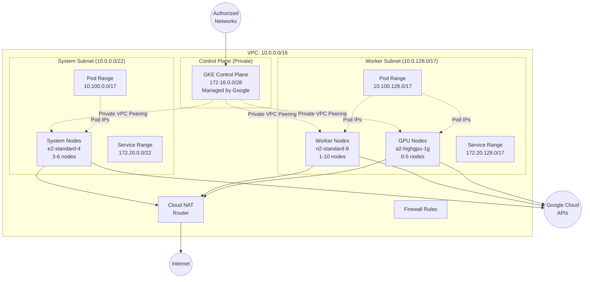
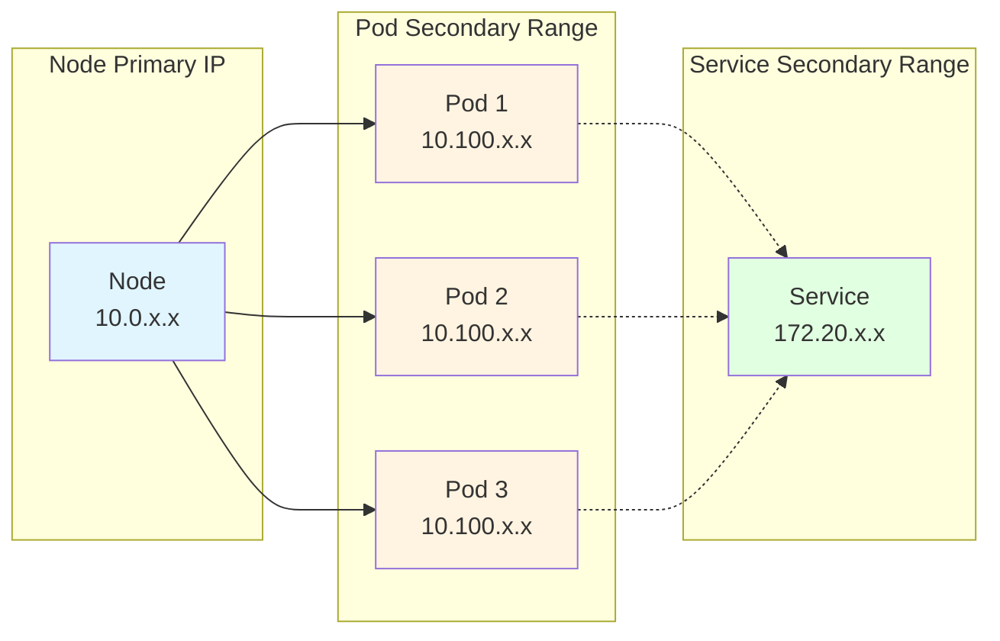

# Google Kubernetes Engine (GKE) Cluster Builder

> **Easy deployment with advanced networking, security, and observability features for GCP.**

## 📋 Table of Contents

- [Overview](#overview)
- [Quick Start](#quick-start)
- [Architecture](#architecture)
- [Key Features](#key-features)
- [Network Architecture](#network-architecture)
- [Configuration Guide](#configuration-guide)
- [Security](#security)
- [Monitoring & Observability](#monitoring--observability)
- [Outputs](#outputs)
- [Known Limitations](#known-limitations)
- [Troubleshooting](#troubleshooting)
- [Migration from AWS EKS](#migration-from-aws-eks)
- [Additional Resources](#additional-resources)

---

## 🎯 Overview

This Terraform module deploys a fully-featured Google Kubernetes Engine (GKE) cluster with:

- **Regional cluster deployment** for high availability across zones
- **Custom VPC networking** with secondary ranges for pods and services
- **Workload Identity** for secure pod-to-GCP service authentication
- **Private cluster** with authorized networks for control plane access
- **Advanced security** with KMS encryption, Shielded Nodes, and Binary Authorization support
- **Full observability** with Cloud Monitoring and Cloud Logging integration
- **Production-ready configurations** including auto-scaling, auto-repair, and auto-upgrade

### Architecture Diagram



---

## 🚀 Quick Start

### Prerequisites

- **GCP CLI**: `gcloud` command-line tool
- **Terraform**: Version >= 1.13.0
- **yq**: YAML processor (v4+)
- **GCP Project**: With billing enabled

### 1. Initial Setup

```bash
# Authenticate with GCP
gcloud auth login
gcloud config set project YOUR_PROJECT_ID

# Clone the repository and navigate to GKE terraform
cd gcp/gke/tf

# Create your configuration file
cp configs/demo.yaml configs/my-cluster.yaml
# Edit configs/my-cluster.yaml with your settings
```

### 2. Run Setup Script

The setup script will:
- Enable required GCP APIs
- Create GCS bucket for Terraform state
- Create service account with appropriate permissions
- Generate service account key

```bash
./tools/setup configs/my-cluster.yaml
```

**Output:**
```
[MSG] Project ID: my-project-id
[MSG] Region:     us-central1
[MSG] Service Account: cluster-builder-sa@my-project-id.iam.gserviceaccount.com
[MSG] Bucket:     cluster-builder-state-my-project-id
[MSG] Output:     /path/to/terraform
[MSG] Enabling required GCP APIs...
[MSG] Creating GCS bucket: cluster-builder-state-my-project-id in region us-central1
[MSG] Created backend configuration in /path/to/terraform/backend.hcl
[MSG] Creating service account: cluster-builder-sa
[MSG] Granting roles/compute.admin to cluster-builder-sa
```

### 3. Deploy Cluster

```bash
tools/actuate configs/my-cluster.yaml
```

**What happens:**
1. Terraform initializes with GCS backend
2. Plans infrastructure changes
3. Creates:
   - VPC network with subnets and secondary ranges
   - Cloud NAT and firewall rules
   - KMS keys for secrets encryption
   - IAM service accounts and bindings
   - GKE cluster with specified version/channel
   - Node pools (system and workers)
4. Generates `configs/my-cluster-status.yaml` with cluster details

**Expected output:**
```
Apply complete! Resources: 32 added, 0 changed, 0 destroyed.

Outputs:

access = {
  "gcloud_auth" = "gcloud container clusters get-credentials demo2 --region us-east5 --project my-project"
}
cluster = {
  "endpoint" = "34.162.51.217"
  "location" = "us-east5"
  "name" = "demo2"
  "version" = "1.33.4-gke.1172000"
}
...
```

> **Note:** Cluster creation typically takes 10-15 minutes. Node pools are created in parallel after the cluster control plane is ready.

### 4. Access Cluster

```bash
# Get cluster credentials
gcloud container clusters get-credentials demo-cluster \
  --region us-central1 \
  --project my-project-id

# Verify access
kubectl get nodes
kubectl get pods --all-namespaces
```

---

## ⭐ Key Features

### 🔐 Security

| Feature | Description | Status |
|---------|-------------|--------|
| **Cloud KMS Encryption** | Customer-managed keys for cluster secrets | ✅ Configurable |
| **Shielded GKE Nodes** | Secure boot and integrity monitoring | ✅ Enabled |
| **Workload Identity** | Pod-level GCP service authentication | ✅ Enabled |
| **Private Cluster** | Control plane on private IP with VPC peering | ✅ Enabled |
| **Binary Authorization** | Deploy-time security policy enforcement | ⚙️ Configurable |
| **Network Policies** | Pod-to-pod communication control (Calico) | ✅ Enabled |
| **Authorized Networks** | Control plane API access restrictions | ✅ Configured |

### 📊 Observability

| Component | Purpose | Configuration |
|-----------|---------|---------------|
| **Cloud Logging** | Cluster and workload logs | SYSTEM_COMPONENTS, WORKLOADS |
| **Cloud Monitoring** | Cluster and workload metrics | SYSTEM_COMPONENTS only* |
| **Managed Prometheus** | Native Prometheus metrics collection | ⚙️ Configurable |
| **VPC Flow Logs** | Network traffic analysis | ✅ Enabled on subnets |

> **Note:** WORKLOADS monitoring component is only supported in GKE versions 1.20-1.23. For GKE 1.24+, use Managed Prometheus for workload metrics.

### 🚀 Operational Excellence

- **Auto-scaling**: Horizontal node pool autoscaling per zone
- **Auto-repair**: Automatic node repair for unhealthy nodes
- **Auto-upgrade**: Automatic node OS and Kubernetes version upgrades
- **Release Channels**: RAPID, REGULAR, or STABLE version management
- **Maintenance Windows**: Scheduled maintenance during specified times
- **Regional Clusters**: Multi-zone control plane and node distribution

### 🎛️ GKE Add-ons

| Add-on | Purpose | Status |
|--------|---------|--------|
| **HTTP Load Balancing** | Ingress controller for external HTTP(S) traffic | ✅ Enabled |
| **Horizontal Pod Autoscaling** | Automatic pod scaling based on metrics | ✅ Enabled |
| **Vertical Pod Autoscaling** | Automatic resource request/limit tuning | ⚙️ Configurable |
| **GCE Persistent Disk CSI** | Block storage for persistent volumes | ✅ Enabled |
| **Filestore CSI Driver** | NFS-based shared storage | ⚙️ Configurable |
| **GCS FUSE CSI Driver** | Object storage mounting | ⚙️ Configurable |

---

## 🏗️ Network Architecture

### VPC and Subnet Design

```
Primary VPC CIDR: 10.0.0.0/16 (65,536 IPs)
├── System Subnet:     10.0.0.0/22      (1,024 IPs for system nodes)
│   ├── Pods:          10.100.0.0/17    (32,768 pod IPs)
│   └── Services:      172.20.0.0/22    (1,024 service IPs)
│
└── Worker Subnet:     10.0.128.0/17    (32,768 IPs for worker nodes)
    ├── Pods:          10.100.128.0/17  (32,768 pod IPs)
    └── Services:      172.20.128.0/17  (32,768 service IPs)

Control Plane VPC Peering: 172.16.0.0/28 (16 IPs for master nodes)
```

### GKE Networking Model

**VPC-Native Clusters** (alias IPs):
- Node IPs: From primary subnet range
- Pod IPs: From secondary pod range
- Service IPs: From secondary service range
- Efficient routing without NAT for pod-to-pod communication



### Cloud NAT Configuration

- **Purpose**: Provides outbound internet access for private nodes
- **Source IP Ranges**: All subnets, all IP ranges
- **Min Ports per VM**: 64 ports per node
- **Log Configuration**: Errors only to reduce costs

---

## 📝 Configuration Guide

### Configuration File Structure

The configuration is defined in a YAML file similar to the AWS EKS format:

```yaml
apiVersion: github.com/mchmarny/cluster/v1alpha1
kind: Cluster

deployment:
  id: d1                          # Prefix for all resources
  csp: GCP
  project: "my-project-id"        # GCP project ID
  region: us-central1
  tags:
    owner: mchmarny
    env: dev

cluster:
  name: demo-cluster
  version: "1.31"                 # or null for latest in release channel
  releaseChannel: STABLE          # RAPID, REGULAR, STABLE, or null

  features:
    workloadIdentity: true
    verticalPodAutoscaling: true
    httpLoadBalancing: true
    horizontalPodAutoscaling: true
    networkPolicy: true
    gcpFilestoreCsiDriver: false
    gcsFuseCsiDriver: false

  private:
    enabled: true
    masterIpv4CidrBlock: 172.16.0.0/28

  controlPlane:
    cidr: 172.20.0.0/16           # Service CIDR
    podCidr: 10.100.0.0/16        # Pod CIDR
    authorizedNetworks:           # IPs allowed to access API server
      - cidr: 203.0.113.0/24
        name: office

network:
  name: gke-network
  cidr: 10.0.0.0/16

  subnets:
    nodes:
      - name: system-subnet
        cidr: 10.0.0.0/22
        region: us-central1
        privateGoogleAccess: true

    secondary:
      system-subnet:
        pods:
          rangeName: system-pods
          cidr: 10.100.0.0/17
        services:
          rangeName: system-services
          cidr: 172.20.0.0/22

  nat:
    enabled: true
    sourceSubnetIpRangesToNat: ALL_SUBNETWORKS_ALL_IP_RANGES
    minPortsPerVm: 64

compute:
  nodePools:
    system:
      machineType: e2-standard-4
      imageType: COS_CONTAINERD
      diskType: pd-standard
      diskSizeGb: 100
      
      autoscaling:
        enabled: true
        minNodes: 3
        maxNodes: 6
        locationPolicy: BALANCED

      nodeConfig:
        preemptible: false
        spot: false
        labels:
          nodeGroup: system
        taints:
          - key: dedicated
            value: system-workload
            effect: NO_SCHEDULE

    workers:
      - name: cpu-worker-1
        machineType: n2-standard-8
        autoscaling:
          minNodes: 1
          maxNodes: 10

      # GPU worker pool - commented out in demo config due to availability
      # - name: gpu-worker-1
      #   machineType: a3-highgpu-1g
      #   guestAccelerator:
      #     type: h100
      #     count: 1
      #     gpuDriverInstallation:
      #       gpuDriverVersion: DEFAULT
```

> **GPU Node Pool Note:** GPU availability varies by region and zone. Before enabling GPU node pools, verify availability:
> ```bash
> gcloud compute accelerator-types list --filter="zone:YOUR_REGION"
> ```

### Node Pool Types

#### System Node Pool
- **Purpose**: Runs cluster system components (kube-system, monitoring, etc.)
- **Recommended**: Standard instances with guaranteed resources
- **Taints**: `dedicated=system-workload:NoSchedule`

#### Worker Node Pools
- **Purpose**: Runs application workloads
- **Types**: 
  - CPU workers: General compute (n2, c2, e2 families)
  - GPU workers: ML/AI workloads (a2, g2 families)
- **Taints**: Custom per workload type

### Machine Types

| Family | Use Case | Examples |
|--------|----------|----------|
| **E2** | Cost-optimized, burstable | e2-standard-4, e2-medium |
| **N2** | Balanced compute | n2-standard-8, n2-highmem-16 |
| **C2** | Compute-optimized | c2-standard-16, c2-standard-30 |
| **A2** | GPU workloads (A100) | a2-highgpu-1g, a2-megagpu-16g |
| **G2** | GPU workloads (L4) | g2-standard-4, g2-standard-8 |

### GPU Configuration

```yaml
guestAccelerator:
  type: H100                    # H100, GB200
  count: 1                      # Number of GPUs per node
  gpuDriverInstallation:
    gpuDriverVersion: DEFAULT   # or LATEST, or specific version
  gpuSharingConfig:             # Optional: for MIG or time-sharing
    strategy: TIME_SHARING
    maxSharedClients: 2
```

**Supported GPUs:**
- **T4**: H100
- **A100**: GB200

---

## 🔒 Security

### Workload Identity

Workload Identity enables Kubernetes pods to authenticate as GCP service accounts without service account keys.

**Configuration:**
1. Enable in cluster features (done automatically)
2. Create GCP service account for your app
3. Bind Kubernetes service account to GCP service account

```bash
# Create GCP service account
gcloud iam service-accounts create my-app-sa \
  --project=my-project-id

# Grant permissions
gcloud projects add-iam-policy-binding my-project-id \
  --member="serviceAccount:my-app-sa@my-project-id.iam.gserviceaccount.com" \
  --role="roles/storage.objectViewer"

# Bind to Kubernetes service account
gcloud iam service-accounts add-iam-policy-binding \
  my-app-sa@my-project-id.iam.gserviceaccount.com \
  --role="roles/iam.workloadIdentityUser" \
  --member="serviceAccount:my-project-id.svc.id.goog[NAMESPACE/KSA_NAME]"

# Annotate Kubernetes service account
kubectl annotate serviceaccount KSA_NAME \
  --namespace NAMESPACE \
  iam.gke.io/gcp-service-account=my-app-sa@my-project-id.iam.gserviceaccount.com
```

### Shielded GKE Nodes

- **Secure Boot**: Ensures nodes boot with verified software
- **Integrity Monitoring**: Validates runtime integrity
- **Enabled by default** in this configuration

### Network Policies

Network policies control pod-to-pod communication using Calico.

**Example:**
```yaml
apiVersion: networking.k8s.io/v1
kind: NetworkPolicy
metadata:
  name: deny-all-ingress
spec:
  podSelector: {}
  policyTypes:
  - Ingress
```

---

## 📊 Monitoring & Observability

### Cloud Logging

Configured to collect:
- **SYSTEM_COMPONENTS**: kubelet, container runtime, node problem detector
- **WORKLOADS**: Application container logs

**View logs:**
```bash
# View cluster logs
gcloud logging read "resource.type=k8s_cluster" --project=my-project-id

# View pod logs
kubectl logs POD_NAME -n NAMESPACE --follow
```

### Cloud Monitoring

Configured to collect:
- **SYSTEM_COMPONENTS**: Node and system metrics
- **WORKLOADS**: Pod and container metrics (GKE 1.20-1.23 only)

> **Note:** For GKE 1.24+, the WORKLOADS monitoring component is not supported. Use Managed Prometheus for workload-level metrics instead.

**View metrics in console:**
```
https://console.cloud.google.com/monitoring/dashboards/resourceList/gke_cluster?project=PROJECT_ID
```

### Managed Prometheus (Optional)

When enabled, collects Prometheus metrics natively:

```bash
# Query with PromQL
kubectl port-forward -n gmp-system svc/frontend 9090:9090
# Visit http://localhost:9090
```

---

## 📤 Outputs

### Status File

After deployment, a status YAML file is generated alongside your config file:

**Example: `configs/my-cluster-status.yaml`**
```yaml
apiVersion: github.com/mchmarny/cluster/v1alpha1
kind: ClusterStatus
metadata:
  name: demo-cluster
  timestamp: "2025-10-16T20:00:00Z"

deployment:
  id: d1
  project: my-project-id
  region: us-central1

cluster:
  name: demo-cluster
  location: us-central1
  version: "1.31.2-gke.1000"
  status: RUNNING
  kubernetes:
    endpoint: https://35.x.x.x
    clusterCaCertificate: <base64-encoded>
    serviceCidr: 172.20.0.0/22
    clusterCidr: 10.100.0.0/17

compute:
  nodePools:
  - name: system
    type: system
    machineType: e2-standard-4
    minNodes: 3
    maxNodes: 6
    nodeCount: 3
    status: RUNNING

network:
  vpc:
    id: projects/my-project-id/global/networks/d1-gke-network
    name: d1-gke-network

security:
  kms:
    keyRing: d1-gke-keyring
    cryptoKey: d1-gke-secrets
  serviceAccounts:
    systemNodes: d1-system-nodes@my-project-id.iam.gserviceaccount.com
    workerNodes: d1-worker-nodes@my-project-id.iam.gserviceaccount.com

access:
  gcloud:
    command: gcloud container clusters get-credentials demo-cluster --region us-central1 --project my-project-id
```

### Terraform Outputs

```bash
terraform output deployment
terraform output cluster
terraform output node_pools
```

---

## ⚠️ Known Limitations

### GKE Version Constraints

1. **Workload Monitoring (GKE 1.24+)**
   - The `WORKLOADS` component in `monitoring.enableComponents` is only supported in GKE versions 1.20-1.23
   - For GKE 1.24 and later, use Managed Prometheus for workload metrics
   - System components monitoring works in all versions

2. **Workload Identity Binding Format**
   - Workload Identity IAM bindings must use specific namespace/service account format
   - Format: `serviceAccount:PROJECT_ID.svc.id.goog[NAMESPACE/SERVICE_ACCOUNT]`
   - Wildcards like `[*/*]` are not supported
   - Example: `my-project.svc.id.goog[kube-system/default]`

### GPU Availability

- GPU types have limited regional and zonal availability
- H100 GPUs may not be available in all zones of a region
- Always check availability before configuring GPU node pools:
  ```bash
  gcloud compute accelerator-types list --filter="zone:YOUR_REGION"
  ```

### Regional Considerations

- Not all GCP regions support all features (e.g., certain GPU types, machine types)
- Private clusters require VPC peering with Google-managed VPC
- Cross-region traffic incurs additional egress charges

---

## 🔧 Troubleshooting

### Common Issues

#### 1. API Not Enabled

**Error:**
```
Error: Error creating Cluster: googleapi: Error 403: ...API has not been enabled
```

**Solution:**
```bash
gcloud services enable container.googleapis.com --project=PROJECT_ID
# Or re-run tools/setup
```

#### 2. Quota Exceeded

**Error:**
```
Error: Error waiting for creating GKE NodePool: ... Insufficient regional quota
```

**Solution:**
- Check quotas: `gcloud compute project-info describe --project=PROJECT_ID`
- Request quota increase in GCP Console

#### 3. Node Pool Creation Timeout

**Error:**
```
Error: timeout while waiting for state to become 'RUNNING'
```

**Solution:**
- Check node pool status: `gcloud container node-pools list --cluster=CLUSTER_NAME --region=REGION`
- Check for underlying errors: `gcloud container operations list`

#### 4. Workload Identity Not Working

**Symptoms:** Pods cannot access GCP services

**Solution:**
```bash
# Verify Workload Identity is enabled on cluster
gcloud container clusters describe CLUSTER_NAME --region=REGION \
  --format="value(workloadIdentityConfig.workloadPool)"

# Verify node pool has Workload Identity metadata
gcloud container node-pools describe POOL_NAME \
  --cluster=CLUSTER_NAME --region=REGION \
  --format="value(config.workloadMetadataConfig.mode)"

# Should be: GKE_METADATA
```

#### 5. Workload Identity IAM Binding Error

**Error:**
```
Error: Invalid service account (PROJECT_ID.svc.id.goog[*/*])
```

**Cause:** Wildcard patterns `[*/*]` are not valid in Workload Identity IAM bindings.

**Solution:** Use specific namespace/service account format:
- `serviceAccount:PROJECT_ID.svc.id.goog[NAMESPACE/SERVICE_ACCOUNT]`
- Example: `my-project.svc.id.goog[kube-system/default]`

#### 6. Workload Monitoring Not Supported

**Error:**
```
Error 400: Workload monitoring configuration is not supported for cluster version X.XX
```

**Cause:** WORKLOADS monitoring component is only supported in GKE 1.20-1.23.

**Solution:**
- For GKE 1.24+: Remove WORKLOADS from `observability.monitoring.enableComponents`
- Use Managed Prometheus instead: `observability.monitoring.managedPrometheus: true`

#### 7. GPU Accelerator Not Available

**Error:**
```
Error 400: Accelerator type "nvidia-h100" does not exist in zone ZONE
```

**Cause:** GPU types have limited availability by region/zone.

**Solution:**
```bash
# Check GPU availability in your region
gcloud compute accelerator-types list --filter="zone:us-east5"

# Options:
# 1. Use available GPU type (e.g., nvidia-tesla-t4)
# 2. Change to a region with desired GPU availability
# 3. Disable GPU node pool if not needed
```

### Useful Commands

```bash
# Check cluster status
gcloud container clusters describe CLUSTER_NAME --region=REGION

# List node pools
gcloud container node-pools list --cluster=CLUSTER_NAME --region=REGION

# Describe node pool
gcloud container node-pools describe POOL_NAME \
  --cluster=CLUSTER_NAME --region=REGION

# View cluster operations
gcloud container operations list

# SSH to node (for debugging)
gcloud compute ssh NODE_NAME --zone=ZONE

# View cluster credentials
gcloud container clusters get-credentials CLUSTER_NAME \
  --region=REGION --project=PROJECT_ID
```

### Destroy Cluster

To destroy the cluster, set `destroy: true` in your config and run:

```bash
./tools/actuate configs/my-cluster.yaml
```

**Warning:** This will:
- Delete all node pools
- Delete the GKE cluster
- Delete VPC resources (if not in use by other resources)
- Preserve the GCS state bucket and KMS keys

---

## 📚 Additional Resources

- [GKE Documentation](https://cloud.google.com/kubernetes-engine/docs)
- [GKE Best Practices](https://cloud.google.com/kubernetes-engine/docs/best-practices)
- [Workload Identity Setup](https://cloud.google.com/kubernetes-engine/docs/how-to/workload-identity)
- [GKE Release Notes](https://cloud.google.com/kubernetes-engine/docs/release-notes)
- [Terraform GCP Provider](https://registry.terraform.io/providers/hashicorp/google/latest/docs)
