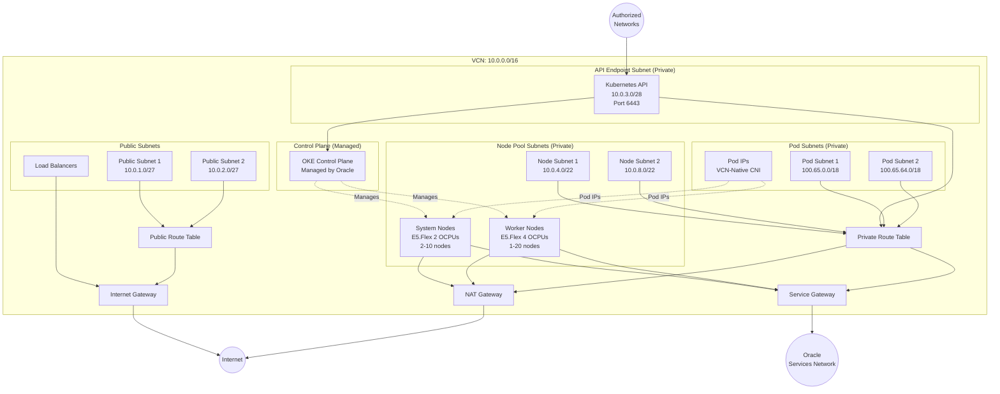

# Oracle Kubernetes Engine (OKE) Cluster Builder

> **Easy deployment with advanced networking, security, and observability features for Oracle Cloud Infrastructure.**

## 📋 Table of Contents

- [Overview](#overview)
- [Quick Start](#quick-start)
- [Architecture](#architecture)
- [Key Features](#key-features)
- [Network Architecture](#network-architecture)
- [Configuration Guide](#configuration-guide)
- [Security](#security)
- [Monitoring & Observability](#monitoring--observability)
- [Outputs](#outputs)
- [Troubleshooting](#troubleshooting)
- [Additional Resources](#additional-resources)

---

## 🎯 Overview

This Terraform module deploys a fully-featured Oracle Kubernetes Engine (OKE) cluster with:

- **Regional cluster deployment** for high availability across availability domains
- **Custom VCN networking** with separate subnets for API endpoints, nodes, and pods
- **Native VCN-IP CNI** for high-performance pod networking
- **Private cluster** with authorized networks for control plane access
- **Advanced security** with IAM policies, dynamic groups, and security lists
- **Full observability** with OCI Logging and Metrics integration
- **Production-ready configurations** including auto-scaling, auto-repair, and flexible compute shapes

### Architecture Diagram



---

## 🚀 Quick Start

### Prerequisites

- **OCI CLI**: `oci` command-line tool
- **Terraform**: Version >= 1.13.0
- **yq**: YAML processor (v4+)
- **OCI Account**: With necessary permissions
- **SSH Key Pair**: For node access

### 1. Install OCI CLI

```bash
# macOS
brew install oci-cli

# Linux
bash -c "$(curl -L https://raw.githubusercontent.com/oracle/oci-cli/master/scripts/install/install.sh)"

# Verify installation
oci --version
```

### 2. Configure OCI CLI

```bash
# Run configuration wizard
oci setup config

# This will prompt you for:
# - User OCID
# - Tenancy OCID
# - Region
# - Generate API key pair

# Verify configuration
oci iam region list --output table
```

### 3. Initial Setup

```bash
# Clone repository
cd oci/tf

# Copy and customize configuration
cp configs/demo.yaml configs/my-cluster.yaml
vim configs/my-cluster.yaml

# Update the following required fields:
# - deployment.tenancy: Your OCI tenancy OCID
# - deployment.compartment: Your OCI compartment OCID
# - deployment.region: Your OCI region
# - deployment.tags.owner: Your username
# - cluster.controlPlane.allowedCidrs: Your IP addresses
# - compute.sshPublicKey: Your SSH public key

# Run setup script to create Object Storage bucket
./tools/setup configs/my-cluster.yaml
```

### 4. Deploy Cluster

```bash
# Set OCI authentication environment variables
export OCI_USER_OCID='ocid1.user.oc1..aaaaaaaXXXXXX'
export OCI_FINGERPRINT='aa:bb:cc:dd:ee:ff:00:11:22:33:44:55:66:77:88:99'
export OCI_PRIVATE_KEY_PATH='~/.oci/oci_api_key.pem'

# Deploy the cluster
./tools/actuate configs/my-cluster.yaml

# This will:
# 1. Initialize Terraform with OCI Object Storage backend
# 2. Plan the deployment
# 3. Apply the configuration
# 4. Generate kubeconfig file

# Configure kubectl
export KUBECONFIG=$(terraform -chdir=terraform output -raw kubeconfig_path)
kubectl get nodes
```

### 5. Verify Deployment

```bash
# Check nodes
kubectl get nodes -o wide

# Check system pods
kubectl get pods -A

# View cluster info
kubectl cluster-info

# Check OKE cluster details
oci ce cluster list --compartment-id <your-compartment-ocid>
```

---

## 🏗️ Key Features

### Networking

- **VCN-Native Pod Networking**: OCI VCN IP Native CNI for optimal performance
- **Separate Subnets**: Dedicated subnets for API endpoints, nodes, and pods
- **Regional Subnets**: High availability across availability domains
- **Service Gateway**: Direct connectivity to Oracle Services Network
- **NAT Gateway**: Secure internet access for private subnets
- **Security Lists**: Fine-grained network access controls

### Compute

- **Flexible Shapes**: Support for VM.Standard and GPU shapes
- **Autoscaling**: Built-in cluster and node pool autoscaling
- **Multiple Node Pools**: Separate pools for system and workload nodes
- **Custom Images**: Support for custom OKE node images
- **SSH Access**: Optional SSH access to nodes for debugging

### Security

- **Private Cluster**: API endpoint in private subnet
- **Authorized Networks**: Restrict API access to specific CIDRs
- **Dynamic Groups**: IAM integration for pod identity
- **Security Lists**: Network-level firewall rules
- **Encryption**: Data encryption in transit and at rest

### Observability

- **OCI Logging**: Integration with OCI Logging service
- **OCI Monitoring**: Metrics and alarms for cluster health
- **Audit Logging**: Track API calls and administrative actions
- **Resource Tagging**: Comprehensive tagging for cost tracking

### High Availability

- **Regional Deployment**: Cluster spans multiple availability domains
- **Node Auto-Repair**: Automatic replacement of failed nodes
- **Pod Disruption Budgets**: Configurable for critical workloads
- **Load Balancer Integration**: Automatic creation of OCI load balancers

---

## 📐 Network Architecture

### CIDR Allocation

Default CIDR blocks (customizable in config):

```
VCN CIDR:         10.0.0.0/16      (65,536 IPs)
├── Public Subnets:    10.0.1.0/27  - 10.0.2.0/27   (32 IPs each)
├── API Endpoint:      10.0.3.0/28                  (16 IPs)
├── Node Pools:        10.0.4.0/22  - 10.0.8.0/22   (1,024 IPs each)
└── Pods:              100.65.0.0/16                (65,536 IPs)
    ├── Pod Subnet 1:  100.65.0.0/18                (16,384 IPs)
    └── Pod Subnet 2:  100.65.64.0/18               (16,384 IPs)

Service CIDR:     172.20.0.0/16   (65,536 IPs for Kubernetes services)
```

### Subnet Types

1. **Public Subnets**: For load balancers and public-facing services
2. **API Endpoint Subnet**: Private subnet for Kubernetes API server
3. **Node Pool Subnets**: Private subnets for worker nodes
4. **Pod Subnets**: Secondary IP ranges for pod networking (VCN-Native CNI)

---

## ⚙️ Configuration Guide

### Configuration File Structure

```yaml
apiVersion: github.com/mchmarny/cluster/v1alpha1
kind: Cluster

deployment:
  id: d1                          # Unique deployment identifier
  csp: OCI                        # Cloud Service Provider
  tenancy: "ocid1.tenancy..."     # OCI Tenancy OCID
  compartment: "ocid1.compartment..."  # OCI Compartment OCID
  region: us-ashburn-1            # OCI Region
  deletionProtection: false       # Protect against accidental deletion
  tags:                           # Freeform tags
    owner: username
    env: dev

cluster:
  name: demo                      # Cluster name
  version: "v1.33.1"             # Kubernetes version
  addons:                         # OKE managed addons
    clusterAutoscaler: false
    kubernetesDashboard: false
    certManager: false
  controlPlane:
    cidr: 172.20.0.0/16          # Service CIDR
    allowedCidrs:                 # API access whitelist
      - 1.2.3.4/32

network:
  cidrs:
    host: 10.0.0.0/16            # VCN CIDR
    pod: 100.65.0.0/16           # Pod CIDR
  subnets:                        # Subnet definitions
    public: [...]
    apiEndpoint: [...]
    nodePools: [...]
    pods: [...]

compute:
  sshPublicKey: "ssh-ed25519..."  # SSH public key for nodes
  nodePools:
    system:
      type: system
      shape: VM.Standard.E5.Flex  # OCI compute shape
      ocpus: 2                    # Number of OCPUs
      memoryGb: 16                # Memory in GB
      diskSizeGb: 100             # Boot volume size
      size: 3                     # Initial node count
      autoscaling:
        enabled: true
        minSize: 2
        maxSize: 10
```

### Compute Shapes

OCI offers various compute shapes:

#### AMD-based Shapes
- `VM.Standard.E5.Flex`: AMD EPYC 4th Gen (Flexible OCPUs/Memory)
- `VM.Standard.E4.Flex`: AMD EPYC 3rd Gen
- `VM.DenseIO.E5.Flex`: High local NVMe storage

#### GPU Shapes
- `VM.GPU.A10.1`: NVIDIA A10 (1 GPU)
- `VM.GPU.A10.2`: NVIDIA A10 (2 GPUs)
- `BM.GPU.A100-v2.8`: NVIDIA A100 (8 GPUs, bare metal)

#### ARM-based Shapes
- `VM.Standard.A1.Flex`: Ampere Altra (ARM64)

---

## 🔒 Security

### IAM Configuration

The module creates:

1. **Dynamic Groups**: For node pool identity
2. **Policies**: For OCI service integration
   - Volume management (Block Storage, File Storage)
   - Load balancer management
   - Network resource access
   - Object Storage access

### Network Security

1. **Security Lists**: Network-level access controls
2. **Private Subnets**: Nodes and pods in private subnets
3. **NAT Gateway**: Controlled internet egress
4. **Service Gateway**: Private connectivity to Oracle services

### Best Practices

1. **Use Compartments**: Organize resources by environment/project
2. **Restrict API Access**: Limit `allowedCidrs` to known IPs
3. **Enable Encryption**: Use KMS for encryption at rest
4. **Rotate Credentials**: Regularly rotate API keys
5. **Use Bastion**: Access nodes via bastion host
6. **Audit Logging**: Enable and monitor audit logs

---

## 📊 Monitoring & Observability

### OCI Monitoring

The cluster integrates with OCI Monitoring:

```bash
# View cluster metrics
oci monitoring metric list --compartment-id <compartment-ocid>

# Create custom alarms
oci monitoring alarm create --display-name "High CPU" \
  --compartment-id <compartment-ocid> \
  --metric-compartment-id <compartment-ocid> \
  --namespace oci_computeagent \
  --query "CpuUtilization[1m].mean() > 80"
```

### OCI Logging

```bash
# List logs
oci logging log list --log-group-id <log-group-ocid>

# Search logs
oci logging-search search-logs \
  --search-query "search \"<compartment-ocid>\" | where type='com.oraclecloud.oke'"
```

---

## 📤 Outputs

The module provides comprehensive outputs:

```hcl
output "cluster_id"           # OKE cluster OCID
output "cluster_name"         # Cluster name
output "cluster_endpoint"     # Kubernetes API endpoint
output "cluster_version"      # Kubernetes version
output "vcn_id"              # VCN OCID
output "node_pools"          # Node pool details
output "kubeconfig_path"     # Path to kubeconfig file
output "status"              # Complete deployment status (JSON)
```

### Accessing Outputs

```bash
# Get cluster endpoint
terraform -chdir=terraform output cluster_endpoint

# Get kubeconfig path
terraform -chdir=terraform output -raw kubeconfig_path

# Get full status JSON
terraform -chdir=terraform output -json status
```

---

## 🔧 Troubleshooting

### Common Issues

#### 1. "Service limit exceeded"

**Problem**: OCI service limits reached

**Solution**:
```bash
# Check service limits
oci limits quota list --compartment-id <compartment-ocid>

# Request limit increase in OCI Console
```

#### 2. "Insufficient capacity"

**Problem**: No available capacity in availability domain

**Solution**:
- Try different shape or availability domain
- Use capacity reservations for critical workloads
- Consider flexible shapes (E5.Flex, A1.Flex)

#### 3. "InvalidParameter: subnet"

**Problem**: Subnet configuration mismatch

**Solution**:
```bash
# Verify subnet CIDRs don't overlap
# Ensure subnets are in correct availability domains
# Check security list rules
```

#### 4. "API authentication error"

**Problem**: OCI CLI authentication issues

**Solution**:
```bash
# Verify OCI config
cat ~/.oci/config

# Test authentication
oci iam user get --user-id <your-user-ocid>

# Check environment variables
echo $OCI_USER_OCID
echo $OCI_FINGERPRINT
echo $OCI_PRIVATE_KEY_PATH
```

#### 5. "Cannot access cluster"

**Problem**: Kubeconfig or network issue

**Solution**:
```bash
# Verify kubeconfig
kubectl config view

# Test API connectivity
kubectl get nodes -v=8

# Check your IP is in allowedCidrs
curl -s https://checkip.amazonaws.com

# Verify bastion/VPN connectivity for private clusters
```

### Debugging

```bash
# Enable Terraform debug logging
export TF_LOG=DEBUG
export TF_LOG_PATH=./terraform.log

# Check OCI CLI debug
oci --debug ce cluster list

# Validate OCI permissions
oci iam user list-groups --user-id <user-ocid>
```

---

## 🧹 Cleanup

### Destroy Cluster

```bash
# Update config to enable destruction
yq -i '.deployment.destroy = true' configs/my-cluster.yaml

# Run actuate script
./tools/actuate configs/my-cluster.yaml

# Confirm with 'yes' when prompted
```

### Manual Cleanup

```bash
# Delete cluster via OCI CLI
oci ce cluster delete --cluster-id <cluster-ocid>

# Delete VCN
oci network vcn delete --vcn-id <vcn-ocid>

# Delete Object Storage bucket
oci os bucket delete --bucket-name cluster-builder-state-d1
```

---

## 📚 Additional Resources

### OCI Documentation

- [OKE Overview](https://docs.oracle.com/en-us/iaas/Content/ContEng/Concepts/contengoverview.htm)
- [OCI Terraform Provider](https://registry.terraform.io/providers/oracle/oci/latest/docs)
- [OCI CLI Reference](https://docs.oracle.com/en-us/iaas/tools/oci-cli/latest/oci_cli_docs/)
- [VCN-Native Pod Networking](https://docs.oracle.com/en-us/iaas/Content/ContEng/Concepts/contengpodnetworking_topic-OCI_CNI_plugin.htm)

### Terraform Resources

- [oci_containerengine_cluster](https://registry.terraform.io/providers/oracle/oci/latest/docs/resources/containerengine_cluster)
- [oci_containerengine_node_pool](https://registry.terraform.io/providers/oracle/oci/latest/docs/resources/containerengine_node_pool)
- [oci_core_vcn](https://registry.terraform.io/providers/oracle/oci/latest/docs/resources/core_vcn)

### Community

- [OCI Cloud Native Slack](https://oracledevs.slack.com/)
- [Terraform OCI Provider GitHub](https://github.com/oracle/terraform-provider-oci)

---

## 📝 License

This project is licensed under the MIT License - see the [LICENSE](../../LICENSE) file for details.
