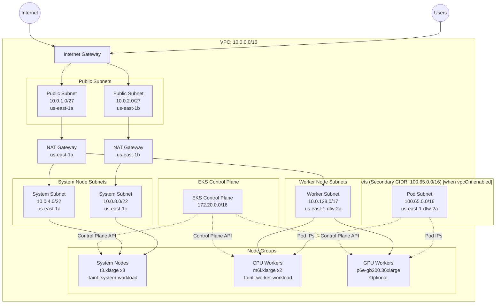
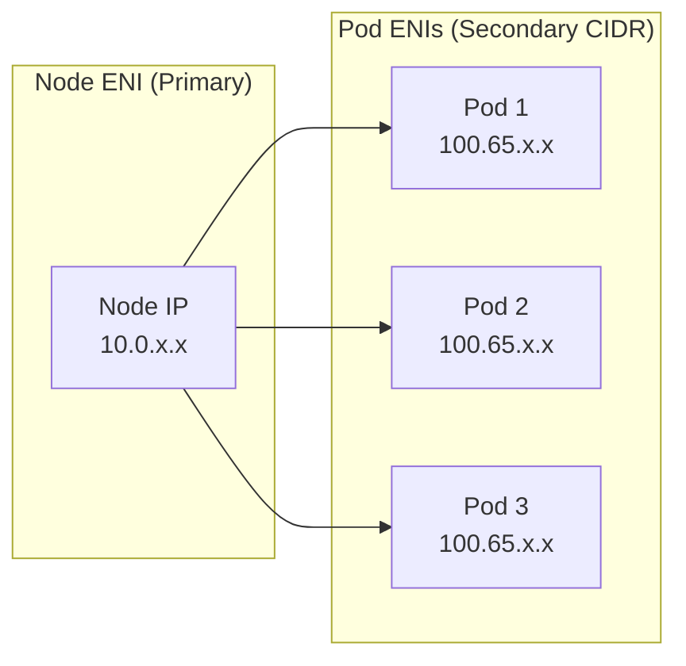
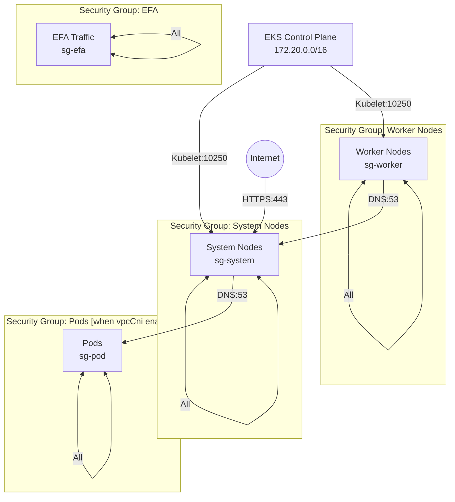

# Amazon EKS Cluster Builder

Production-ready EKS deployment with advanced networking, security, and observability.

## Table of Contents

- [Overview](#overview)
- [Deployment](#deployment)
- [Test Plan](#test-plan)
- [Architecture](#architecture)
- [Network Architecture](#network-architecture)
- [Configuration Guide](#configuration-guide)
- [Security](#security)
- [Monitoring and Observability](#monitoring-and-observability)
- [Outputs](#outputs)
- [Troubleshooting](#troubleshooting)

---

## Overview

This Terraform module deploys a fully-featured Amazon EKS cluster with:

- Multi-AZ deployment for high availability
- Optional VPC CNI custom networking (secondary CIDR for pods) -- enabled via `cluster.addOns.vpcCni`
- Self-managed node groups with system and worker node separation
- Advanced security with KMS encryption, VPC Flow Logs, and security group isolation
- Full observability with CloudWatch integration and metrics
- Production-ready configurations including health checks, auto-scaling, and instance refresh

### Architecture Diagram



---

## Deployment

### Prerequisites

- **AWS CLI** >= 2.0 configured with appropriate credentials
- **yq** >= 4.0 for YAML parsing

### 1. Generate Config (optional)

Generate a starter config, or copy from an existing example in `config/`:

```shell
docker run --rm \
  -v $PWD/config:/config \
  ghcr.io/mchmarny/cluster/eks:latest init /config/eks-example.yaml
```

### 2. Discover Versions (optional)

Find latest K8s versions, add-on versions, and AMIs available in your region:

```shell
provider/eks/tools/disco -r us-east-1
```

This also prints your current IAM identity and role name for use in `cluster.adminRoles`.

### 3. Setup Tenancy (one-time)

Bootstrap the AWS account with state bucket, IAM user, and access key. Run as yourself with admin credentials:

```shell
provider/eks/tools/setup -c config/eks-example.yaml -o ./keys
```

This creates:
- S3 state bucket `cluster-state-{account-id}` with versioning and encryption
- IAM user, policy, and access key (saved to the output directory)

### 4. Apply

Deploy using the service account key from setup:

```shell
docker run --rm \
  -e KEY_CONTENT="$(base64 < ./keys/.{id}-{account}-key.json)" \
  -e CONFIG_CONTENT="$(base64 < config/eks-example.yaml)" \
  ghcr.io/mchmarny/cluster/eks:latest apply
```

Deployment time: approximately 15-20 minutes for full cluster creation.

### 5. Output (optional)

Retrieve deployment outputs (endpoint, access command, etc.) and save to the state volume:

```shell
docker run --rm \
  -v $PWD/state:/state \
  -e KEY_CONTENT="$(base64 < ./keys/.{id}-{account}-key.json)" \
  -e CONFIG_CONTENT="$(base64 < config/eks-example.yaml)" \
  ghcr.io/mchmarny/cluster/eks:latest output
```

The output JSON is saved to `/state/{id}-{account}-output.json`.

### 6. Destroy

Set `deployment.destroy: true` in the config and re-run apply (step 4).

This will delete all node groups, EKS cluster, VPC, KMS keys (with deletion window), and CloudWatch logs.

### Local Deployment (without container)

The shell tools under `provider/eks/tools/` can also drive Terraform directly:

```shell
provider/eks/tools/actuate -c config/eks-example.yaml apply    # plan + apply
provider/eks/tools/actuate -c config/eks-example.yaml plan     # plan only
provider/eks/tools/validate -c config/eks-example.yaml         # post-deploy checks
```

All scripts source `tools/common` for shared logging, config resolution, and terraform helpers.

---

## Test Plan

A comprehensive test plan is available for validating cluster deployments. See [TEST.md](TEST.md) for:

- **Test 1:** System-only cluster (deploy, verify, destroy)
- **Test 2:** System + multiple CPU worker pools (amd64, arm64)
- **Test 3:** System + CPU + GPU workers with EFA

---

## Key Features

### Security

| Feature | Description |
|---------|-------------|
| KMS Encryption | Customer-managed keys for EKS secrets and logs |
| VPC Flow Logs | Network traffic monitoring to CloudWatch |
| Security Group Isolation | Separate SGs for system, worker, and EFA traffic (pod SG added when vpcCni enabled) |
| Private Node Communication | Nodes communicate via private IPs through NAT |
| IAM Roles for Service Accounts (IRSA) | Pod-level IAM permissions via OIDC |
| Encrypted EBS Volumes | All node volumes encrypted at rest |
| IMDSv2 Required | Enhanced metadata service security |

### Observability

| Component | Purpose | Retention |
|-----------|---------|-----------|
| EKS Control Plane Logs | API server, audit, authenticator logs | 7 days by default |
| VPC Flow Logs | Network traffic analysis | 7 days by default |
| CloudWatch Observability | Cluster metrics and pod logs | Configured |
| Metrics Server | Resource usage metrics (CPU/memory) | Real-time |
| ASG CloudWatch Metrics | 8 metrics per autoscaling group | 1-minute |

### Operational Excellence

- **Health Checks**: EC2 health checks with 5-minute grace period
- **Instance Refresh**: Rolling updates with 90% minimum healthy
- **Auto Scaling**: Cluster Autoscaler tags configured
- **Lifecycle Management**: `ignore_changes` for cluster autoscaler compatibility
- **Termination Policies**: OldestLaunchTemplate, then OldestInstance

### EKS Add-ons

| Add-on | Version | Purpose | IAM Role |
|--------|---------|---------|----------|
| CoreDNS | Auto/Configurable | DNS resolution with custom forwarding | - |
| VPC CNI | Auto/Configurable | Pod networking with custom CIDR (optional -- enables secondary CIDR, pod subnets, ENIConfig) | - |
| kube-proxy | Auto/Configurable | Network proxy | - |
| aws-ebs-csi-driver | Auto/Configurable | Persistent volume support | IRSA |
| metrics-server | Auto/Configurable | Resource metrics | - |
| CloudWatch Observability | Auto/Configurable | Logs and metrics collection | IRSA |

---

## Network Architecture

### VPC CIDR Design

```
Primary VPC CIDR: 10.0.0.0/16 (65,536 IPs)
+-- Public Subnets:    10.0.1.0/27  - 10.0.2.0/27   (64 IPs each)
+-- System Subnets:    10.0.4.0/22  - 10.0.8.0/22   (1,024 IPs each)
+-- Worker Subnets:    10.0.128.0/17                 (32,768 IPs)

When vpcCni add-on is enabled:
Secondary CIDR: 100.65.0.0/16 (65,536 IPs)
+-- Pod Subnets:       100.65.0.0/16                 (All for pods)
```

### VPC CNI Custom Networking

> **Optional.** This feature is enabled when `cluster.addOns.vpcCni` is present in the config. When omitted, pods use the primary VPC CIDR and no secondary CIDR, pod subnets, pod security group, or ENIConfig resources are created.

Custom networking separates node IPs from pod IPs:
- Prevents IP exhaustion on primary CIDR
- Enables larger pod densities per node
- Better security isolation



### ENIConfig Custom Resource

Each availability zone has an ENIConfig specifying:
- **Subnet**: Pod subnet in that AZ
- **Security Groups**: Pod security group
- **Zone Label**: `topology.kubernetes.io/zone`

Example:
```yaml
apiVersion: crd.k8s.amazonaws.com/v1alpha1
kind: ENIConfig
metadata:
  name: us-east-1-dfw-2a
spec:
  subnet: subnet-059ba27f2af6fefb6
  securityGroups:
    - sg-02b0d0a11d801abef
```

### VPC Endpoints

Private endpoints for AWS services (no internet egress required):

- **S3** -- Gateway endpoint
- **SSM, EC2Messages, SSMMessages** -- Session Manager
- **CloudWatch Logs** -- Log shipping

---

## Configuration Guide

### Configuration Tiers

#### Minimal (no custom networking)

The simplest configuration. No VPC CNI custom networking -- pods use the primary VPC CIDR. No secondary CIDR, pod subnets, pod SG, or ENIConfig are created.

```yaml
apiVersion: github.com/mchmarny/cluster/v1alpha1
kind: Cluster

deployment:
  id: mini
  provider: eks
  tenancy: "123456789012"
  location: us-east-1
  state: tenancy

cluster:
  version: "1.35"
  addOns:
    coreDns: ""
    kubeProxy: ""

compute:
  nodeGroups:
    system:
      instanceType: m7i.xlarge
      capacity:
        desired: 2
    workers:
      - name: cpu-worker-1
        instanceType: m7i.xlarge
        capacity:
          desired: 1
        labels:
          nodeGroup: cpu-worker
```

#### With VPC CNI custom networking (auto-computed subnets)

Adding `vpcCni` to `cluster.addOns` enables custom networking. A secondary CIDR (`100.65.0.0/16` by default), pod subnets, pod SG, and ENIConfig are automatically created. Subnet CIDRs are auto-computed from the VPC CIDR when `network.subnets` is omitted.

```yaml
apiVersion: github.com/mchmarny/cluster/v1alpha1
kind: Cluster

deployment:
  id: demo
  provider: eks
  tenancy: "123456789012"
  location: us-east-1

cluster:
  version: "1.35"
  addOns:
    coreDns: ""
    vpcCni: ""
    kubeProxy: ""

compute:
  nodeGroups:
    system:
      instanceType: m6i.xlarge
      capacity:
        desired: 3
```

#### With VPC CNI and explicit network config

Full control over CIDRs and subnets. Pod subnets use the secondary CIDR for VPC CNI custom networking.

```yaml
apiVersion: github.com/mchmarny/cluster/v1alpha1
kind: Cluster

deployment:
  id: d1
  provider: eks
  tenancy: "123456789012"
  location: us-east-1

cluster:
  version: "1.35"
  addOns:
    coreDns: ""
    vpcCni: ""
    kubeProxy: ""

network:
  cidrs:
    host: 10.0.0.0/16
    pod: 100.65.0.0/16
  subnets:
    public:
      - cidr: 10.0.1.0/27
        zone: us-east-1a
      - cidr: 10.0.2.0/27
        zone: us-east-1b
    system:
      - cidr: 10.0.4.0/22
        zone: us-east-1a
      - cidr: 10.0.8.0/22
        zone: us-east-1b
    worker:
      - cidr: 10.0.128.0/17
        zone: us-east-1a
    pod:
      - cidr: 100.65.0.0/18
        zone: us-east-1a
      - cidr: 100.65.64.0/18
        zone: us-east-1b

compute:
  nodeGroups:
    system:
      instanceType: m6i.xlarge
      capacity:
        desired: 3
```

Notes:
- Your current IP is automatically added to the API server allowed CIDRs during deployment
- `sshPublicKey` is optional -- if omitted, no SSH key pair is created
- `imageId` is optional -- if omitted, Terraform selects the latest Ubuntu EKS Worker AMI based on the `architecture` property (defaults to x86_64)
- `architecture` is optional -- set to `arm64` for Graviton instance types, defaults to `x86_64`
- When using automatic AMI selection, `cluster.version` must be specified

### Defaults Applied by Terraform

| Setting | Default |
|---------|---------|
| VPC CIDR | `10.0.0.0/16` |
| Pod CIDR | `100.65.0.0/16` (only when `vpcCni` enabled) |
| Service CIDR | `172.20.0.0/16` |
| VPC endpoints | s3, ssm, ec2messages, ssmmessages, logs |
| Log retention | 7 days |
| Node image | Ubuntu EKS Worker AMI from Canonical |
| Node architecture | x86_64 (set `architecture: arm64` for Graviton) |
| Workers | Optional (system-only cluster supported) |

### Full Configuration Example

```yaml
apiVersion: github.com/mchmarny/cluster/v1alpha1
kind: Cluster

deployment:
  id: d1
  tenancy: "123456789101"  # AWS account ID
  location: us-east-1
  tags:
    owner: mchmarny
    env: dev

cluster:
  name: demo-cluster
  version: "1.33"  # optional, defaults to latest
  addOns:  # optional, empty version "" defaults to latest, or null to disable
    coreDns: ""
    vpcCni: ""
    kubeProxy: ""
    cloudwatchObservability: ""
    metricsServer: ""
    ebsCsi: ""
  controlPlane:
    cidr: 172.20.0.0/16
    allowedCidrs: # CIDRs allowed to access control plane (e.g. kubectl)
      - 20.30.40.50/27
      - 2.3.4.5/32
  adminRoles:  # Run tools/disco to get your role name
    - ClusterAdmins                    # Simple IAM role name
    # - AWSReservedSSO_Admin_abc123    # AWS SSO role (auto-detected)
    # - arn:aws:iam::123:role/MyRole   # Full ARN (used as-is)

observability:
  logRetentionInDays: 7
  metricsGranularity: "1Minute"

network:
  cidrs:
    host: 10.0.0.0/16
    pod: 100.65.0.0/16
  subnets:
    public:
      - cidr: 10.0.1.0/27
        zone: us-east-1a
      - cidr: 10.0.2.0/27
        zone: us-east-1b
    system:
      - cidr: 10.0.4.0/22
        zone: us-east-1a
      - cidr: 10.0.8.0/22
        zone: us-east-1c
    worker:
      - cidr: 10.0.128.0/17
        zone: us-east-1-dfw-2a
        disableEndpoints: true
    pod:
      - cidr: 100.65.0.0/16
        zone: us-east-1-dfw-2a
        disableEndpoints: true
  endpoints:
    - s3
    - ssm
    - ec2messages
    - ssmmessages
    - logs

compute:
  sshPublicKey: "ssh-ed25519 AAA..."  # Optional: omit for no SSH access

  nodeGroups:

    system:
      instanceType: t3.xlarge
      imageId: ami-0ad0f739ba9218571  # Optional: omit for auto-selected Ubuntu EKS AMI (x86_64)
      capacity:
        desired: 3
        min: 3
        max: 6
      blockDevice:
        mount: "/dev/sda1"
        type: gp3
        size: 500
      labels:
        nodeGroup: system

    workers:
      - name: amd-cpu-worker-1
        instanceType: m6i.xlarge
        # imageId: optional for x86_64, auto-selects Ubuntu EKS AMI
        capacity:
          desired: 1  # min/max are inferred from desired
        blockDevice:
          mount: "/dev/sda1"
          type: gp3
          size: 50
        labels:
          nodeGroup: cpu-worker

      - name: arm-cpu-worker-1  # example of multiple node groups of the same type, block device omitted to use defaults
        instanceType: c6gn.xlarge
        architecture: arm64  # Required for Graviton/ARM instances (enables auto-select of ARM64 AMI)
        # imageId: ami-xxx  # Optional: explicit AMI overrides architecture-based auto-select
        capacity:
          desired: 1
        labels:
          nodeGroup: cpu-worker

      - name: gpu-worker-1
        instanceType: p6e-gb200.36xlarge
        gpuType: gb200
        imageId: ami-09bf1e83f45a97282
        capacity:
          desired: 0
          reservation:  # example of capacity reservation usage
            marketType: capacity-block
            preference: capacity-reservations-only
            target: demo-gb200-rg  # supports: cr-xxx, arn:..., or group name
        labels:
          nodeGroup: gpu-worker
```

### Node Group Types

#### System Nodes
- **Purpose**: Run cluster-critical workloads (CoreDNS, metrics-server, etc.)
- **Taint**: `dedicated=system-workload:NoSchedule,NoExecute`
- **Instance Type**: General-purpose (e.g. t3.xlarge for x86_64, m8g.medium for ARM64)
- **Architecture**: Supports both x86_64 (default) and arm64 (set `architecture: arm64`)
- **Tolerations**: Required for system pods

#### Worker Nodes
- **Purpose**: Run application workloads
- **Taint**: `dedicated=worker-workload:NoSchedule,NoExecute`
- **Instance Types**:
  - CPU (x86_64): `m6i.xlarge` (general compute)
  - CPU (ARM64): `m8g.xlarge`, `c6gn.xlarge` (Graviton -- set `architecture: arm64`)
  - GPU: `p6e-gb200.36xlarge` (AI/ML with GB200 GPUs)
  - EFA: Automatically configured for GPU instances

### Capacity Reservations

For GPU instances, use capacity reservations with the unified `target` field:

```yaml
capacity:
  desired: 1
  reservation:
    preference: capacity-reservations-only
    target: cr-0cbe491320188dfa6          # See formats below
```

#### Reservation Types

| Type | `marketType` | `target` format | Example |
|------|--------------|-----------------|---------|
| On-Demand Capacity Reservation (ODCR) | Not needed | `cr-xxx` | `cr-0cbe491320188dfa6` |
| Capacity Block for ML | `capacity-block` | ARN | `arn:aws:ec2:region:account:capacity-block/...` |
| Spot Instances | `spot` | Not needed | N/A |
| Resource Group (shared) | Optional | ARN or name | `my-resource-group` |

#### Target Field Formats

| Format | Example | Description |
|--------|---------|-------------|
| Direct CR ID | `cr-0cbe491320188dfa6` | Uses `capacity_reservation_id` directly |
| Full ARN | `arn:aws:resource-groups:us-west-2:123456789:group/my-group` | Uses ARN as-is |
| Group name | `demo-gb200-rg` | Auto-constructs ARN from account/region |

#### Configuration Examples

On-Demand Capacity Reservation (most common):
```yaml
reservation:
  preference: capacity-reservations-only
  target: cr-0cbe491320188dfa6
```

Capacity Block for ML:
```yaml
reservation:
  marketType: capacity-block
  preference: capacity-reservations-only
  target: arn:aws:ec2:us-east-1:123456789:capacity-block/cr-xxx
```

Spot Instances (no reservation):
```yaml
reservation:
  marketType: spot
```

Shared Resource Group:
```yaml
reservation:
  preference: capacity-reservations-only
  target: my-shared-gpu-group
```

### Operational Parameters (Optional)

All operational parameters have sensible defaults but can be customized:

```yaml
security:
  kms:
    deletionWindowInDays: 30      # KMS key deletion window (7-30 days)

observability:
  logRetentionInDays: 7           # EKS cluster logs retention
  vpcFlowLogs:
    retentionInDays: 7            # VPC Flow Logs retention
  metrics:
    granularity: "1Minute"        # CloudWatch metrics: "1Minute" or "5Minute"

networking:
  coreDns:
    cacheSeconds: 30              # DNS cache TTL in seconds
  vpcCni:
    minimumIpTarget: 30           # Minimum IPs to maintain per node
    warmIpTarget: 20              # Pre-allocated warm IPs per node

compute:
  defaults:
    blockVolumeSize: 50           # Default EBS volume size (GB)
    blockVolumeType: "gp3"        # Default EBS volume type

  autoscaling:
    healthCheck:
      type: "EC2"                 # Health check type: "EC2" or "ELB"
      gracePeriod: 300            # Seconds before health checks start
    capacityTimeout: "10m"        # Max wait time for capacity
    terminationPolicies:          # Order of instance termination
      - "OldestLaunchTemplate"
      - "OldestInstance"
    instanceRefresh:
      minHealthyPercentage: 90    # Min % healthy during rolling updates
      instanceWarmup: 300         # Seconds for new instances to warm up
      checkpointPercentages: [50, 100]  # Validation checkpoints

cluster:
  addOns:
    coreDns: ""                              # "" = use latest
    vpcCni: "v1.20.2-eksbuild.1"            # Specific version
    kubeProxy: ""                            # "" = use latest
    cloudwatchObservability: ""              # "" = use latest
    metricsServer: ""                        # "" = use latest
    ebsCsi: null                             # null = disabled
```

#### Parameter Defaults

| Category | Parameter | Default | Valid Range/Options |
|----------|-----------|---------|---------------------|
| Security | KMS deletion window | 30 days | 7-30 days |
| Observability | EKS log retention | 7 days | 1, 3, 5, 7, 14, 30, 60, 90 |
| | VPC Flow Log retention | 7 days | Same as above |
| | Metrics granularity | 1Minute | 1Minute, 5Minute |
| Networking | CoreDNS cache TTL | 30 seconds | 0-300 seconds |
| | VPC CNI minimum IPs | 30 | 1-100 |
| | VPC CNI warm IPs | 20 | 1-100 |
| Compute | Block volume size | 50 GB | 8-16384 GB |
| | Block volume type | gp3 | gp2, gp3, io1, io2 |
| ASG | Health check type | EC2 | EC2, ELB |
| | Health check grace | 300 sec | 0-7200 seconds |
| | Capacity timeout | 10m | Valid duration string |
| | Min healthy % | 90% | 0-100 |
| | Instance warmup | 300 sec | 0-3600 seconds |

### Best Practices

**Configuration Management:**
1. Store configs in Git
2. Never commit sensitive data (SSH keys, credentials)
3. Use separate configs for dev/staging/prod
4. Use consistent deployment IDs (e.g., `{env}-{region}-{number}`)

**Security:**
1. Restrict Control Plane Access -- use specific CIDR blocks, not `0.0.0.0/0`
2. Enable All Logs -- always enable control plane logging for audit
3. Rotate Keys -- regularly update SSH keys and KMS keys
4. Least Privilege -- grant minimum IAM permissions needed

**Cost Optimization:**
1. Right-Size Instances -- start small, scale based on actual usage
2. Use Spot Instances -- for non-critical worker nodes
3. Enable Autoscaling -- scale down during off-hours
4. Monitor Costs -- set up CloudWatch billing alarms

---

## Deployment Tools

### tools/setup

Prepares AWS account for cluster deployment.

```shell
provider/eks/tools/setup -c config/eks-example.yaml -o ./keys
```

Operations performed:
1. Validates AWS credentials and account ID
2. Creates or validates S3 state bucket (versioning, encryption, lifecycle, public access blocking)
3. Creates IAM user, policy with minimum required permissions, and access key
4. Saves key JSON to the output directory

### tools/actuate

Main deployment tool for creating/updating/destroying clusters.

```shell
provider/eks/tools/actuate -c config/eks-example.yaml apply
```

Features:
- Automatic Terraform initialization with S3 backend
- State migration support
- Plan generation with output caching
- Automatic apply with change validation
- Destroy mode via configuration flag

State path: `s3://{bucket}/deployments/{region}/{deployment-id}/terraform.tfstate`

### tools/disco

Discovery tool for EKS versions, add-on compatibility, and current IAM identity.

```shell
provider/eks/tools/disco -r us-east-1
```

Output includes:
- Current IAM identity (account, ARN, role name for `adminRoles` config)
- Supported Kubernetes versions for EKS
- Latest 5 versions for each add-on (coredns, vpc-cni, kube-proxy, cloudwatch, metrics-server, ebs-csi)

AWS SSO roles (starting with `AWSReservedSSO_`) are auto-detected. Use the role name directly in `cluster.adminRoles`.

### tools/validate

Cluster validation tool that performs automated post-deployment checks.

```shell
provider/eks/tools/validate -c config/eks-example.yaml
```

Checks: EKS cluster status/version/endpoint, VPC configuration, VPC endpoints, node count/readiness, ASG configuration, security groups, IAM roles. When `vpcCni` is enabled: ENI configs, pod subnets, VPC CNI pods.

---

## Security

### Encryption

| Component | Encryption Method | Key |
|-----------|------------------|-----|
| EKS Secrets | KMS encryption | Customer-managed |
| EBS Volumes | EBS encryption | AWS-managed |
| CloudWatch Logs | KMS encryption | Customer-managed |
| VPC Flow Logs | KMS encryption | Customer-managed |

### Security Groups



#### Security Group Rules Summary

**System Node SG:**
- Inbound: Self (all), HTTPS from workers/pods/control plane, kubelet from control plane
- Outbound: All

**Worker Node SG:**
- Inbound: Self (all), kubelet from control plane, ephemeral ports from system
- Outbound: All

**Pod SG** (only when `vpcCni` enabled)**:**
- Inbound: Self (all), traffic from nodes
- Outbound: All

**EFA SG:**
- Inbound: Self (all) for high-bandwidth GPU communication
- Outbound: Self (all)

### IAM Roles

| Role | Purpose | Policies |
|------|---------|----------|
| `eks-cluster` | EKS control plane | EKSClusterPolicy, EKSVPCResourceController |
| `system-nodes` | System EC2 instances | EKSWorkerNodePolicy, CNI, ECR, SSM, FSx, EBS CSI, custom monitoring |
| `worker-nodes` | Worker EC2 instances | EKSWorkerNodePolicy, CNI, ECR, SSM, EBS CSI |
| `cloudwatch-observability` | IRSA for CloudWatch | CloudWatchAgentServerPolicy, XRayDaemonWriteAccess |
| `ebs-csi-driver` | IRSA for EBS CSI | AmazonEBSCSIDriverPolicy |
| `vpc-flow-logs` | VPC Flow Logs | Custom CloudWatch Logs policy |

---

## Monitoring and Observability

### CloudWatch Log Groups

```
/aws/eks/demo/cluster
+-- api
+-- authenticator
+-- audit
+-- scheduler
+-- controllerManager

/aws/vpc/<id>-flow-logs
```

### Metrics Available

Node Metrics (via metrics-server):
```bash
kubectl top nodes
kubectl top pods -A
```

ASG CloudWatch Metrics:
- GroupDesiredCapacity, GroupInServiceInstances, GroupMaxSize, GroupMinSize
- GroupPendingInstances, GroupStandbyInstances, GroupTerminatingInstances, GroupTotalInstances

Custom Queries:
```bash
aws logs tail /aws/eks/$CLUSTER/cluster --follow    # Pod logs
aws logs tail /aws/vpc/$DEPLOYMENT-flow-logs --follow  # VPC Flow Logs
```

### CloudWatch Observability Agent

Deployed components:
- **Controller Manager**: Manages observability configuration
- **CloudWatch Agent** (cw-observability): Collects metrics
- **Fluent Bit**: Streams pod logs to CloudWatch

```bash
kubectl get pods -n amazon-cloudwatch
kubectl logs -n amazon-cloudwatch -l app.kubernetes.io/name=amazon-cloudwatch-observability
```

---

## Outputs

After successful deployment, Terraform outputs comprehensive cluster information.

### Deployment Information

```hcl
deployment = {
  accountId     = "<ACCOUNT_ID>"
  clusterName   = "actuator-cluster"
  region        = "us-east-1"
  lastUpdatedOn = "2025-10-16T10:30:00Z"
}
```

### Cluster Details

```hcl
cluster = {
  kubernetes = {
    api  = "https://XXXXX.gr7.us-east-1.eks.amazonaws.com"
    ca   = "LS0tLS1CRUdJTi..." # Base64 encoded CA certificate
    cidr = "172.20.0.0/16"
  }
  oidc = {
    arn    = "arn:aws:iam::<ACCOUNT_ID>:oidc-provider/oidc.eks.us-east-1.amazonaws.com/id/XXXXX"
    issuer = "https://oidc.eks.us-east-1.amazonaws.com/id/XXXXX"
  }
  addons = {
    coredns = { arn = "...", version = "v1.11.3-eksbuild.2" }
    vpc_cni = { arn = "...", version = "v1.20.1-eksbuild.1" }
    # ... other addons
  }
}
```

### Network Information

```hcl
network = {
  vpc = {
    id            = "vpc-0abc123def456"
    cidr          = "10.0.0.0/16"
    secondaryCidr = "100.65.0.0/16"  # null when vpcCni disabled
  }
  subnets = {
    public = { public1 = { id = "subnet-...", cidr = "10.0.1.0/27", zone = "us-east-1a" } }
    system = { system1 = { id = "subnet-...", cidr = "10.0.4.0/22", zone = "us-east-1a" } }
    worker = { worker1 = { id = "subnet-...", cidr = "10.0.128.0/17", zone = "us-east-1-dfw-2a" } }
    pod    = { pod1    = { id = "subnet-...", cidr = "100.65.0.0/16", zone = "us-east-1-dfw-2a" } }  # empty when vpcCni disabled
  }
  security = {
    cluster = "sg-..."
    system  = "sg-..."
    worker  = "sg-..."
    pod     = "sg-..."  # null when vpcCni disabled
  }
}
```

### Compute Resources

```hcl
compute = {
  nodeGroups = {
    system = {
      launchTemplate = "t1-system"
      autoscalingGroup = "t1-system"
      type = "system"
    }
    amd-cpu-worker-1 = {
      launchTemplate = "t1-amd-cpu-worker-1"
      autoscalingGroup = "t1-amd-cpu-worker-1"
      type = "worker"
    }
  }
}
```

### IAM Roles

```hcl
iam = {
  roles = {
    cluster     = "arn:aws:iam::<ACCOUNT_ID>:role/t1-eks"
    systemNodes = "arn:aws:iam::<ACCOUNT_ID>:role/t1-system-nodes"
    workerNodes = "arn:aws:iam::<ACCOUNT_ID>:role/t1-worker-nodes"
    cloudwatch  = "arn:aws:iam::<ACCOUNT_ID>:role/t1-cloudwatch-observability"
    ebsCsi      = "arn:aws:iam::<ACCOUNT_ID>:role/t1-ebs-csi-driver"
    vpcFlowLogs = "arn:aws:iam::<ACCOUNT_ID>:role/t1-vpc-flow-logs"
  }
}
```

### Accessing Outputs

```bash
terraform -chdir="./terraform" output
```

---

## Troubleshooting

### Nodes Not Ready

Symptoms: nodes show `NotReady` status.

Causes: VPC CNI not running, ENIConfig not matching node zone (when `vpcCni` enabled), security group blocking CNI traffic.

```bash
kubectl get ds aws-node -n kube-system
kubectl get eniconfig
kubectl get nodes --show-labels | grep topology.kubernetes.io/zone
kubectl logs -n kube-system -l k8s-app=aws-node
```

### Pods Pending Due to Taints

Pod doesn't have toleration for node taints. Add to pod spec:

```yaml
tolerations:
- key: "dedicated"
  operator: "Equal"
  value: "worker-workload"
  effect: "NoSchedule"
- key: "dedicated"
  operator: "Equal"
  value: "worker-workload"
  effect: "NoExecute"
```

### EBS Volumes Not Attaching

EBS CSI driver not installed or IAM role misconfigured.

```bash
aws eks list-addons --cluster-name demo
kubectl get pods -n kube-system -l app.kubernetes.io/name=aws-ebs-csi-driver
aws iam get-role --role-name demo3-ebs-csi-driver
```

### Cluster Autoscaler Not Scaling

Missing ASG tags. Required tags:
- `k8s.io/cluster-autoscaler/demo=owned`
- `k8s.io/cluster-autoscaler/enabled=true`

```bash
aws autoscaling describe-auto-scaling-groups \
  --auto-scaling-group-names demo3-cpu-worker-1 \
  --query 'AutoScalingGroups[].Tags'
```

### Metrics Server Not Working

```bash
kubectl get deployment metrics-server -n kube-system
kubectl logs -n kube-system deployment/metrics-server
```

### Terraform State Lock Error

Previous deployment interrupted or concurrent deployments.

```bash
aws dynamodb get-item \
  --table-name terraform-lock \
  --key '{"LockID":{"S":"cluster-state-{account}/deployments/{region}/{id}/terraform.tfstate"}}'

# If stale, force unlock (use with caution)
terraform -chdir=terraform force-unlock <lock-id>
```

### Terraform Plan/Apply Mismatch

Inconsistent dependency lock file. Fixed in latest `tools/actuate`. If still occurring:

```bash
rm -f terraform/.terraform.lock.hcl
rm -f terraform/plan.cache
provider/eks/tools/actuate -c config/eks-example.yaml apply
```

### Debugging Commands

```bash
kubectl cluster-info
kubectl get --raw='/readyz?verbose'
aws eks describe-addon --cluster-name demo --addon-name vpc-cni
kubectl describe node <node-name>
aws ec2 describe-security-groups --group-ids sg-xxx
aws logs tail /aws/eks/cluster/t1-actuator-cluster --follow
kubectl get eniconfig -o yaml
kubectl run test-pod --image=busybox --rm -it -- sh
terraform -chdir=terraform show
aws s3 ls s3://cluster-state-{account-id}/deployments/{region}/{id}/
yq eval config/eks-example.yaml
aws sts get-caller-identity
```
