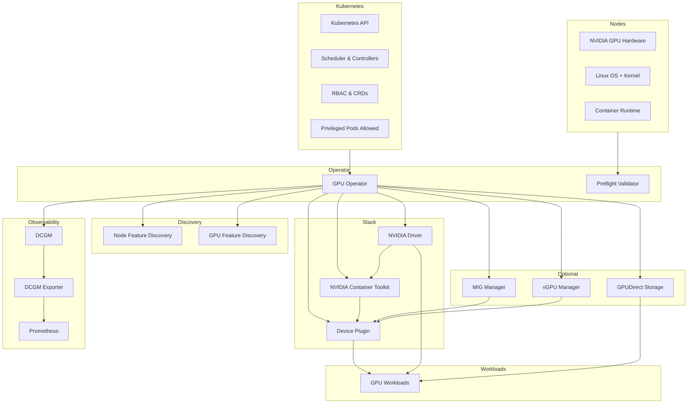

# GPU Operator Runtime Dependencies

This document describes **all runtime dependencies required by NVIDIA GPU Operator**, including:
- Cluster-level prerequisites
- Node-level prerequisites
- Operator-managed components
- Optional features
- Observability stack
- A full dependency graph showing how everything fits together

The goal is to make explicit **what must already exist in the cluster**, **what the Operator installs**, and **how GPU workloads ultimately depend on these components**.

---

## 1. Scope

This document covers **runtime dependencies**, not:
- CI/CD pipelines
- Image build processes
- Offline mirroring or air-gapped distribution
- Cluster provisioning (EKS/GKE/AKS/bootstrap)

It assumes a functioning Kubernetes cluster and focuses on what is required **at install time and during steady-state runtime**.

---

## 2. Kubernetes Cluster Prerequisites

The GPU Operator assumes the following Kubernetes capabilities are already present.

### 2.1 Core Kubernetes Capabilities
- Kubernetes API server and controllers are operational
- Scheduler is functional
- etcd is healthy

### 2.2 Workload Capabilities
- Ability to run **DaemonSets**
- Ability to run **privileged containers**
- Ability to mount host paths (e.g. `/usr`, `/lib/modules`, `/dev`)

These are **hard requirements** for:
- Driver installation
- Device Plugin operation
- DCGM telemetry

### 2.3 RBAC and CRDs
- RBAC enabled
- Ability to create:
  - CustomResourceDefinitions (CRDs)
  - ClusterRoles and ClusterRoleBindings
  - ServiceAccounts

---

## 3. GPU Node Prerequisites

GPU Operator targets **specific nodes** (typically via labels or node selectors). Those nodes must satisfy the following.

### 3.1 Hardware
- NVIDIA GPUs physically present
- GPU architecture supported by the selected driver version

### 3.2 Operating System
- Linux-based OS
- Kernel compatible with the NVIDIA driver
- OS consistency across GPU nodes is strongly recommended if drivers are container-installed

### 3.3 Container Runtime
- Supported container runtime (most commonly `containerd`)
- Runtime must allow:
  - OCI hooks
  - NVIDIA Container Toolkit integration

### 3.4 Node Capabilities
- Functional CNI networking
- Writable local storage for:
  - Driver artifacts
  - Toolkit binaries
  - Runtime state

---

## 4. GPU Operator Core Components

These components form the **control plane** of GPU enablement.

### 4.1 GPU Operator
- Kubernetes controller
- Reconciles desired GPU software state on GPU nodes
- Installs and manages all subordinate components

### 4.2 Validator / Preflight Checks
- Verifies:
  - GPU presence
  - Kernel compatibility
  - Runtime compatibility
- Prevents partial or broken installations

---

## 5. Node Discovery and Labeling

Correct scheduling and feature awareness depend on node labeling.

### 5.1 Node Feature Discovery (NFD)
- Detects CPU, kernel, OS, and PCI capabilities
- Produces node labels consumed by:
  - GPU Operator
  - Kubernetes scheduler

**Notes**
- NFD may be:
  - Installed by GPU Operator (default), or
  - Pre-installed and managed externally
- GPU Operator can be configured to **skip NFD installation**

### 5.2 GPU Feature Discovery (GFD)
- Discovers GPU-specific capabilities:
  - GPU model
  - MIG capability
  - GPU memory size
- Adds GPU-specific labels to nodes

---

## 6. GPU Enablement Stack (Per Node)

These components are installed **on every GPU node** and form the critical dependency chain for GPU workloads.

### 6.1 NVIDIA GPU Driver
- Kernel driver and user-space libraries
- Installed either:
  - By GPU Operator (driver containers), or
  - Pre-installed on the node

This is the **root dependency** for all GPU functionality.

### 6.2 NVIDIA Container Toolkit
- Integrates GPU access into the container runtime
- Injects devices, libraries, and hooks into GPU containers
- Required for **any GPU workload to start**

### 6.3 NVIDIA Kubernetes Device Plugin
- Advertises GPU resources to Kubernetes
- Exposes resources such as:
  - `nvidia.com/gpu`
  - MIG profiles (if enabled)
- Required for scheduler-level GPU allocation

---

## 7. Optional Node-Level Components

These components are enabled **only if required by configuration or use case**.

### 7.1 MIG Manager
- Manages Multi-Instance GPU (MIG) lifecycle
- Coordinates MIG partitioning and reconciliation
- Integrates with the Device Plugin

### 7.2 vGPU Device Manager
- Required for NVIDIA vGPU use cases
- Integrates with licensed vGPU drivers
- Extends Device Plugin behavior

### 7.3 GPUDirect Storage (GDS)
- Enables direct GPU ↔ storage data paths
- Requires:
  - Compatible storage stack
  - Driver and kernel support

---

## 8. Observability and Telemetry

### 8.1 DCGM (Data Center GPU Manager)
- Collects GPU health, utilization, and error metrics
- Depends on:
  - NVIDIA driver
  - GPU hardware

### 8.2 DCGM Exporter
- Exposes DCGM metrics via HTTP
- Designed for Prometheus scraping

### 8.3 Metrics Backend (External)
- Prometheus or compatible metrics scraper
- Not installed by GPU Operator
- Required to consume exported GPU metrics

---

## 9. GPU Workloads (Consumers)

GPU workloads depend on **the entire stack** below them.

### 9.1 Scheduling Dependencies
- Node labels from NFD and GFD
- Resource advertisements from the Device Plugin
- Optional taints and tolerations

### 9.2 Runtime Dependencies
- NVIDIA GPU driver
- NVIDIA Container Toolkit
- NVIDIA Device Plugin

Without **all three**, GPU Pods will fail to start.

---

## 10. Full Dependency Graph

---

## 11. Practical Installation Checklist

Before installing GPU Operator, verify:
	•	GPU nodes allow privileged DaemonSets
	•	Container runtime supports NVIDIA Container Toolkit
	•	Driver strategy chosen (Operator-managed vs pre-installed)
	•	NFD strategy chosen (Operator-managed vs external)
	•	Metrics backend available if GPU telemetry is required
	•	Optional features (MIG, vGPU, GDS) explicitly planned

---

## 12. Key Takeaway

GPU Operator is not a single component.
It is a coordinated runtime control plane that assumes:
	•	Deep host access
	•	Tight coupling between kernel, runtime, and Kubernetes
	•	Explicit ordering and dependency management

Understanding this dependency graph is essential for:
	•	Debugging installation failures
	•	Operating GPU clusters at scale
	•	Managing upgrades and minimizing blast radius
